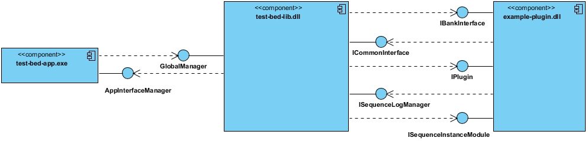

<!--
SPDX-FileCopyrightText: 2019-2021, 2024 Benoit Rolandeau <benoit.rolandeau@allcircuits.com>
SPDX-FileCopyrightText: 2020 Matthieu Seigeot <matthieu.seigeot@allcircuits.com>

SPDX-License-Identifier: LicenseRef-ALLCircuits-ACT-1.1
-->

# Easy Test Bench


## Table of contents

- [Easy Test Bench](#easy-test-bench)
  - [Table of contents](#table-of-contents)
  - [Introduction](#introduction)
  - [Qt](#qt)
  - [OS and compiler](#os-and-compiler)
  - [Plans for future](#plans-for-future)
  - [Project tree description](#project-tree-description)
  - [Our internal process](#our-internal-process)
  - [Licenses](#licenses)
    - [Introduction](#introduction-1)
    - [FAQ](#faq)
      - [Can I use freely this code in my projects?](#can-i-use-freely-this-code-in-my-projects)
      - [Can I modify this code?](#can-i-modify-this-code)
      - [Do I need to share my modification on this repository?](#do-i-need-to-share-my-modification-on-this-repository)
      - [Can I use this code in commercial project? Do I need to pay something?](#can-i-use-this-code-in-commercial-project-do-i-need-to-pay-something)
      - [Can I resell this code?](#can-i-resell-this-code)
      - [You say we can use freely this code in commercial project but we can't resell it, I don't understand!](#you-say-we-can-use-freely-this-code-in-commercial-project-but-we-cant-resell-it-i-dont-understand)
      - [May I add an application or a library with a different license of ALLCircuits-ACT-1.1?](#may-i-add-an-application-or-a-library-with-a-different-license-of-allcircuits-act-11)
      - [May I add a class with a different license of the other classes in the lib or app?](#may-i-add-a-class-with-a-different-license-of-the-other-classes-in-the-lib-or-app)
  - [Global architecture](#global-architecture)
    - [Presentation](#presentation)
    - [How the test bed lib works](#how-the-test-bed-lib-works)
    - [Managed types](#managed-types)
    - [Project files](#project-files)
    - [Sequence files](#sequence-files)
    - [Topology files](#topology-files)
    - [Core library architecture](#core-library-architecture)
  - [Easy Test Bench plugins](#easy-test-bench-plugins)
    - [Introduction](#introduction-2)
    - [Plugins list](#plugins-list)

## Introduction

This repository contains the test bench software created by AC Technologies (ALL Circuits Design
Center).

The project is born from the need of our customers to have a test bench for the production of theirs
consumer products in small or medium series.
They didn't want to buy an expensive test benchs for the first series but they wanted to test it
with the best effort.

Because this need has come more than once, we decided to create this project.

Our main goal is to offer a simple solution for our customers without having to developp a lot of
code each time.

That's why we have though this application around a lib core (which contains the main features and
stays stable in time) and plugins (which extend the core features).
We only create and extend the plugins when needed.

## Qt

The classes contain in this repository are built with Qt (open source version).

The supported Qt version is the latest Qt5 open source LTS: 5.15.2.

We don't support Qt 6 and don't plan to.

In future, we plan to change our strategy of developement in order to no more use Qt. Even if Qt is
a great framework, we are not in harmony with the Qt choices for open source in the last past years.

To find the open source installer in the Qt website:
[Open source Qt installer](https://www.qt.io/download-qt-installer-oss)

## OS and compiler

Most code can be built on:

- Windows:
  - MSVC2019
  - MinGW
- Linux:
  - GCC

But some plugins are currently tied to MS Windows MSVC due to their DLL dependencies
(ex: Visa, Peak). Read their README to see which one.

## Plans for future

At long or medium term, we plan to replace the "test-bed-app" written with QML with a Flutter app.

QML may be tricky to use and it can be difficult to obtain visually what you expect. We use more and
more Flutter in our projects when a HMI has to be done; therefore it makes sense to use it for the
visual part of the test bench.

## Project tree description

```ini
./
├── actlibs/                        # See [#ref1]
├── bankcoreshared/                 # See [#ref2]
├── docs/                           # See [#ref3]
├── examples/                       # See [#ref4]
├── ext-tools/                      # See [#ref5]
|   ├── yq/                         # See [#ref6]
|   ├── .gitignore
|   └── reuse-annotate.sh           # See [#ref7]
├── LICENSES/                       # See [#ref7]
├── plugins/                        # See [#ref8]
|   ├── abstractpluginelements/     # See [#ref9]
|   ├── *-plugin/                   # See [#ref10]
|   ├── *-lib/                      # See [#ref11]
├── test-bed-app/                   # See [#ref12]
├── test-bed-lib/                   # See [#ref13]
├── testbedcore/                    # See [#ref14]
├── .gitignore
├── .gitlab-ci.yml                  # See [#ref15]
├── .gitmodules
├── .mailmap                        # See [#ref7]
├── default-build-params.pri        # See [#ref16]
├── easy-test-bench.code-workspace
├── Jenkinsfile                     # See [#ref17]
├── README.md
└── test-bed.pro
```

With:

- [#ref1]: This folder is a submodule and points to the `ActQtToolbox` repository
- [#ref2]: Contains the interfaces used to communication between the `test-bed-lib` and the plugins
- [#ref3]: Contains the documentations of the project and images to illustrate it
- [#ref4]: Contains examples of project and sequence files
- [#ref5]: Contains external tools used by `test-bed-lib`
- [#ref6]: Contains the `yq` executable used to support YAML files in the `test-bed-lib`
- [#ref7]: Those files and folders are linked to the reuse tool, see
[README-reuse.md](README-reuse.md) for more informations
- [#ref8]: This contains the plugins which can be used by `test-bed-lib`
- [#ref9]: This contains helpful shared classes and includes for all the plugins
- [#ref10]: Those folders are the plugins which can be used with `test-bed-lib`
- [#ref11]: Those folders contain shared classes which may be used in plugins
- [#ref12]: Contains the `test-bed-app` application code written in C++ Qt and QML
- [#ref13]: Contains the `test-bed-lib` core library code written in C++ Qt
- [#ref14]: Contains shared classes between all the libraries, plugins and applications
- [#ref15]: Those files and folders are linked to our GitLab private server
- [#ref16]: This file overrides the default build params, see
[actlibs/README.md](actlibs/README.md#use-shared-dest-directory) for more details
- [#ref17]: Those files and folders are linked to our jenkins server

## Our internal process

We use GitLab for our private repositories and GitHub for the public. For now, we mainly use Jenkins
as CI and for some linting features (as REUSE linting) we use the CI of GitLab.

## Licenses

### Introduction

All the utility classes use our special license :
[ALLCircuits-ACT-1.1](LICENSES/LicenseRef-ALLCircuits-ACT-1.1.txt).

The spirit of this license is to share our code, fruit or our skills and experience, to anyone. You
are free to use and modify it. But we also want to protect our author rights and keep our names on
this code; we don't want to have people trying to resell it.

### FAQ

#### Can I use freely this code in my projects?

Yes, there is no licenses to pay.

#### Can I modify this code?

Yes, just keep our copyright headers on files and feel free to add your names in them.

#### Do I need to share my modification on this repository?

No. However, you are more than welcome to do it! If you find a bug or want to improve the code,
feel free to share your skills and experience.

#### Can I use this code in commercial project? Do I need to pay something?

You are free to use this code in commercial projects and you don't have to pay anything.

However, you have to keep the header licenses in the classes and have our license in your
repositories. It's not because it's free that you can take a full ownership of what we have done.

#### Can I resell this code?

No, it's free to use to everyone, we want to keep it that way.

#### You say we can use freely this code in commercial project but we can't resell it, I don't understand!

When you use this code in your projects, what you sell it's your project, your work: you only use
our code to make your project works. That's fine to us.

However we don't want people trying to sell this code to their clients as their own; and so sell a
work they haven't done. Whether through a license which covers this code or by a rebranding of all,
or nearly all, the content of this repository.

#### May I add an application or a library with a different license of [ALLCircuits-ACT-1.1](LICENSES/LicenseRef-ALLCircuits-ACT-1.1.txt)?

Yes you can, but:

- it has to be a license which keeps the spirit of this repository, and
- it is not a contagious license

> [!NOTE]
> To avoid to have multiple licenses in one application or library, we only accept one license by
> app or library (this doesn't apply to the code you integrate from other repo via submodule).

#### May I add a class with a different license of the other classes in the lib or app?

No, see the previous question.

## Global architecture

### Presentation



The `test-bed-app` is the HMI application of the test bench. It doesn't contain the intelligence of
the test bench, only its views.

The `test-bed-lib` library is the main core of the test bench. All the test bench features are
contained in it. The library loads the `plugins` to extend the test bed lib features.

### How the test bed lib works

The `test-bed-lib` loads [project files](#project-files) which are linked to
[sequence files](#sequence-files) and [topology files](#topology-files); in a project you may have
different sequence file.

A sequence file describes the tests process for a particular board type. A sequence could be
pictured as an UML activity diagram, with some particularities.

The topology files describe the hardware connection in the test bench. They help to manage
multiplexers when you want to read multiple pin values with only one measure instrument (*the
features linked to topology hasn't completly developped*).

The activity blocks are got from the plugins.

The `test-bed-lib` manages the process activities: load sequences, play, pause, stop.

### Managed types

In the test bench library, the following types are managed:

- string
- boolean
- number (a number can an integer or a decimal number)
- string array
- boolean array
- number array

### Project files

The documentation of how sequence files are built can be found here:
[project file documentation](docs/PROJECT_FILE_doc.md).

### Sequence files

The documentation of how sequence files are built can be found here:
[sequence file documentation](docs/SEQUENCE_FILE_doc.md).

### Topology files

The documentation of how sequence files are built can be found here:
[topology file documentation](docs/TOPOLOGY_FILE_doc.md).

### Core library architecture

## Easy Test Bench plugins

### Introduction

### Plugins list

- [analyse-results-plugin](plugins/analyse-results-plugin/README.md)
- [atmel-program-plugin](plugins/atmel-program-plugin/README.md)
- [file-browser-plugin](plugins/file-browser-plugin/README.md)
- [intel-hex-file-plugin](plugins/intel-hex-file-plugin/README.md)
- [logging-plugin](plugins/logging-plugin/README.md)
- [manage-storages-plugin](plugins/manage-storages-plugin/README.md)
- [measure-compare-test-plugin](plugins/measure-compare-test-plugin/README.md)
- [peak-can-plugin](plugins/peak-can-plugin/README.md)
- [manage-storages-plugin](plugins/manage-storages-plugin/README.md)
- [read-settings-plugin](plugins/read-settings-plugin/README.md)
- [scan-data-matrix-plugin](plugins/scan-data-matrix-plugin/README.md)
- [segger-jlink-plugin](plugins/segger-jlink-plugin/README.md)
- [serial-link-plugin](plugins/serial-link-plugin/README.md)
- [time-plugin](plugins/time-plugin/README.md)
- [variable-compare-test-plugin](plugins/variable-compare-test-plugin/README.md)
- [variable-convert-plugin](plugins/variable-convert-plugin/README.md)
- [variable-operations-plugin](plugins/variable-operations-plugin/README.md)
- [vds200-plugin](plugins/vds200-plugin/README.md)
- [visa-com-plugin](plugins/visa-com-plugin/README.md)
