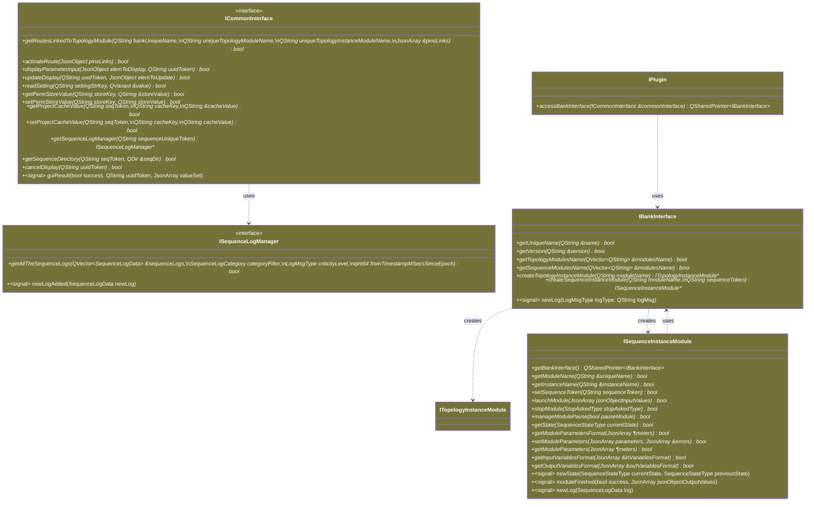

<!--
SPDX-FileCopyrightText: 2024 Benoit Rolandeau <benoit.rolandeau@allcircuits.com>

SPDX-License-Identifier: LicenseRef-ALLCircuits-ACT-1.1
-->

# Plugin and test bed lib API documentation

## Table of contents

- [Plugin and test bed lib API documentation](#plugin-and-test-bed-lib-api-documentation)
  - [Table of contents](#table-of-contents)
  - [Introduction](#introduction)
  - [Class diagram](#class-diagram)
  - [Default classes](#default-classes)

## Introduction

This file contains the definition of the interface between the plugins and test bed lib

## Class diagram

## Default classes

TODO: add here the explanation of how the default classes implements the interface
