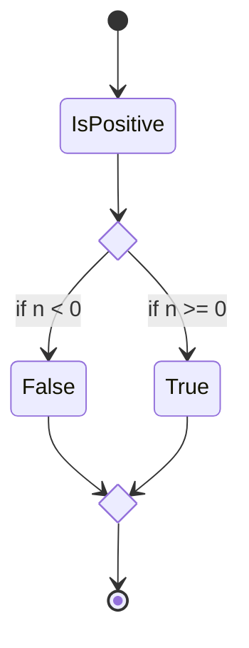
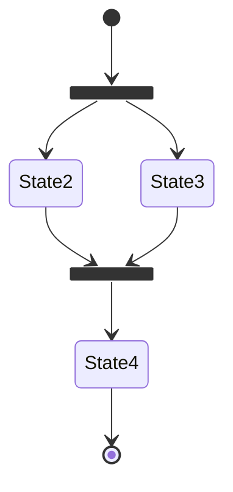

<!--
SPDX-FileCopyrightText: 2024 Benoit Rolandeau <benoit.rolandeau@allcircuits.com>

SPDX-License-Identifier: LicenseRef-ALLCircuits-ACT-1.1
-->

# Sequence file documentation

## Table of contents

- [Sequence file documentation](#sequence-file-documentation)
  - [Table of contents](#table-of-contents)
  - [Presentation](#presentation)
  - [Sequence file minimal requirements](#sequence-file-minimal-requirements)
  - [Common attributes](#common-attributes)
  - [Nodes sequence](#nodes-sequence)
  - [The reference nodes](#the-reference-nodes)
    - [Presentation](#presentation-1)
    - [Constant node](#constant-node)
    - [Variable node](#variable-node)
  - [The sequence nodes](#the-sequence-nodes)
    - [Presentation](#presentation-2)
    - [Initial node](#initial-node)
    - [Final node](#final-node)
    - [Decisional node](#decisional-node)
    - [Merge node](#merge-node)
    - [Fork node](#fork-node)
    - [Join node](#join-node)
    - [Sequence module node](#sequence-module-node)
    - [Group node](#group-node)
    - [Inclusion node](#inclusion-node)

## Presentation

A sequence file is a JSON or YAML file which has the extension:

- `*.tbs` if it's written in JSON
- `*.ytbs` if it's written in YAML

`tbs` means "**t**est **b**ench **s**equence file"

A sequence file may be pictured as an UML activity diagram. The root of the file is a JSON array.
This array contains `nodes`.

A `node` can be:
- A `reference node`,
- A `sequence node` or
- A `nodesSequence` (the node which is the parent of others)

A sequence file could be represented like this:


A `reference node` can be:
- a `variableNode` or
- a `constantNode`

A `sequence node` can be:
- a `sequenceModuleNode`,
- an `initialNode`,
- a `finalNode`,
- a `forkNode`,
- a `joinNode`,
- a `decisionalNode`,
- a `mergeNode`,
- a `groupNode` or
- an `inclusionNode`

You can find some sequence files examples here: [examples](examples/).

## Sequence file minimal requirements

A sequence file must contain at least the three following nodes:
- A `nodesSequence`,
- An `initialNode` and
- A `finalNode`

## Common attributes

Most of the nodes share the following attributes:

- `type`: this is the node type
- `uniqueName`: this is the unique name of the node, the name has to be unique for all the nodes
  contain under the same `nodes sequence`
- `description`: this is the description of the node, we can write what you want here about the node
- `parentInstanceName`: this points to the unique name of the parent `nodes sequence`

Some have also the attribute:

- `toNode`: this attribute allows to chain the nodes together, the previous node targets the next
  node. This attribute doesn't exist for the `finalNode` and it's different for the `forkNode` and
  `decisionalNode`.

## Nodes sequence

The `nodes sequence` is the parent of the other `nodes` (other nodes have necessarily a
`nodes sequence` as parent).

The `nodes sequence` may be connected to external references to prefill the targetted variables.

A sequence file may be called by another sequence file through the `inclusionNode`.

```yaml
- uniqueName: nodesSequenceExample
  type: NodesSequence
  description: The nodes sequence of the current element
  parentInstanceName: ""
  inputs:
    - name: inputPin
      typeManaged: number
      internalBindingRefNodeName: variableNode1
  outputs:
    - name: outputPin
      typeManaged: number
      internalBindingVarNodeName: variableNode1
```

With:

- `type` equals to `NodesSequence`
- `parentInstanceName` has an empty value
- `inputs` contains a list of reference nodes; this allows to give values from sequence variables to
  included child sequence
  - `name`: this is the name to use in the caller sequence to point to the local variable
  - `typeManaged`: this is the expected type for the input element
  - `internalBindingRefNodeName`: this is the node name of the local reference to fill with the
    value, the reference node can be a `constantNode` or a `variableNode`
- `outputs` contains a list of variable nodes from which the values will be exported to the caller
  sequence
  - `name`: this is the name to use in the caller sequence to point to the local variable
  - `typeManaged`: this is the expected type for the output element
  - `internalBindingVarNodeName`: this is the node name of the local variable to get its for the
    caller variable node; the internal node has to be a `variableNode`

## The reference nodes

### Presentation

The `reference nodes` can be a `constantNode` or a `variableNode`. It contains values which can be
tested by a `decisionalNode` but also which can be read and written by the `sequenceModuleNodes`.

The `reference nodes` don't appear on the activity diagram path, they live in parallel of the
sequence.

### Constant node

A `constantNode` has a value set in the sequence file and its value doesn't change in the sequence
life. It can only be read.

```yaml
uniqueName: constantNode
type: ConstantNode
typeManaged: string
parentInstanceName: nodesSequenceName
value: SN-02
```

With:

- `type` equals to `ConstantNode`
- `value` equals to the constant value of the node (it will keep this value in all the sequence
  process)

### Variable node

A `variableNode` has no value set at the start of the sequence and its value can be read and written
in the sequence life.

```yaml
uniqueName: variableNode
type: VariableNode
typeManaged: string
parentInstanceName: nodesSequenceName
```

With:

- `type` equals to `VariableNode`

## The sequence nodes

### Presentation

The `sequence nodes` copy, more or less, the UML activity diagram elements.

### Initial node

All the sequences have to begin with an `initialNode`.

In the sequence file, an `initialNode` is built like this:

```yaml
- uniqueName: initialNodeName
  type: InitialNode
  description: The initial node of the parent NodesSequence
  parentInstanceName: nodesSequenceExample
  toNode: displayLaunchSequenceLog
```

With:

- `type` equals to `InitialNode`

### Final node

All the sequences have to finish with a `finalNode`.

In the sequence file, a `finalNode` is built like this:

```yaml
- uniqueName: finalNodeName
  type: FinalNode
  description: The final node of the parent NodesSequence
  parentInstanceName: nodesSequenceExample
```

With:

- `type` equals to `FinalNode`

### Decisional node

The `decisionalNode` manages paths and depending of conditions, a path is chosen.

The sequence can only take one path at the time. At the end, all the paths must join into a
`mergeNode`. Therefore, when there is a `decisionalNode`, there is also a `mergeNode` somewhere.



```yaml
- uniqueName: decisionalNodeName
  type: DecisionalNode
  description: A decisional node to use in the sequence
  parentInstanceName: nodesSequenceExample
  referenceNodeNameToTest: constantNode2
  defaultNodeName: sequenceModuleNode
  toNodes:
    - toNode: sequenceModuleNode2
      operator: ==
      value: 2
    - toNode: sequenceModuleNode3
      operator: "||"
      elements:
        - operator: ==
          value: 0
        - operator: "&&"
          elements:
            - operator: ">=",
              value: 3
            - operator: "<",
              value: "12,5"
```

With:

- `type` equals to `DecisionalNode`
- `referenceNodeNameToTest` targets a `reference node`. To choose where to go, we test the current
  value contained in the `reference node`. The value is tested when we enter the `DecisionalNode`.
- `defaultNodeName` by default, if no conditions match in the next tests, the sequence continues to
  this node
- `toNodes` contains the different paths and their conditions, you can chain operators to manage
  complex tests. If the value of the `reference node` doesn't match any conditions, the
  `defaultNodeName` is used.
  - `toNode` this is the node where to go, if the next conditions match
  - `operator`, this is the operator to use to test the `reference node` value. There are two kinds
    of operator:
    - The `value operators` which can be `==`, `!=`, `>`, `<`, `>=` or `<=`; the `value operators`
      force to have a `value` attribute next to the `operator` attribute, because you will compare
      the `reference node` value with a constant value. The operators: `>`, `<`, `>=` or `<=` can
      only be used if the `reference node` type is `number`.
    - The `logical operators` which can be: `||` or `&&`; the `logical operators` are used to chain
      the operators, and so we expect to have an `elements` attribute next to `operator` attribute
  - `value` is the value to compare with the `reference node` value.
  - `elements` contains a list of others `operator` and `value` or `elements`

### Merge node

The `mergeNode` is used to join together the different paths created by the a `DecisionalNode`.

The sequence can only take one path at the time. At the end, all the paths must join into a
`mergeNode`. Therefore, when there is a `mergeNode`, there is also a `decisionalNode` somewhere.


```yaml
- uniqueName: mergeNodeName
  type: MergeNode
  description: A merge node to use in the sequence
  parentInstanceName: nodesSequenceExample
  toNode: sequenceModuleNode3
```

With:

- `type` equals to `MergeNode`

### Fork node

The `forkNode` is used to make paths parallel, the nodes in the parallel paths are runned in the
same time. The parallel paths created by a `forkNode` must be joined in a `joinNode`. Therefore,
when there is a `forkNode`, there is also a `joinNode` somewhere.



```yaml
- uniqueName: forkNodeName
  type: ForkNode
  description: A fork node to use in the sequence
  parentInstanceName: nodesSequenceExample
  joinNodeInstanceName: joinNodeName
  toNodes:
    - sequenceModuleNode10
      sequenceModuleNode20
```

With:

- `type` equals to `ForkNode`
- `joinNodeInstanceName` points to the `joinNode` linked to this `forkNode`
- `toNodes` contain the name of the nodes where we begin the parallel paths

### Join node

The `joinNode` is used to join parallel paths created by a `forkNode`. The `joinNode` waits for all
the end of paths before continue to the next node.


```yaml
- uniqueName: joinNodeName
  type: JoinNode
  description: A join node to use in the sequence
  parentInstanceName: nodesSequenceExample
  forkNodeInstanceName: forkNodeName
  toNode: finalNodeName
```

With:

- `type` equals to `JoinNode`
- `forkNodeInstanceName` points to the `forkNode` linked to this `joinNode`

### Sequence module node

The `sequenceModuleNode` is the heart of the sequence, all the complexity and business logic is
stored in it. The `sequenceModuleNode` has `inputs`, `outputs` and `parameters`.

The expected `inputs`, `parameters` and exported `outputs` are defined by the implementations done
in the plugins; they specify what the specific `sequence module` need to work.

All the `sequenceModuleNodes` are contained in the plugins (there are no `sequence modules` in the
`test-bed-lib`).

To know the `sequence modules` already developed, you can read the `sequence modules` description in
the plugins readme, see the [plugins list](#plugins-list).

```yaml
- uniqueName: sequenceModuleNode3
  type: SequenceModuleNode
  description: A sequence module node to use in the sequence
  bankName: plugin-file-basename
  moduleName: moduleclassname
  moduleParameters:
    - name: arithmeticValue
      value: 1
    - name: arithmeticOperator
      values:
        - addKey
  inputs:
    - name: inputPin
      typeManaged: number
      referenceNodeName: variableNode1
  outputs:
    - name: outputPin
      typeManaged: number
      variableNodeName: variableNode1
  parentInstanceName: nodesSequenceExample
  disable: false
  toNode: decisionalNodeName
```

With:

- `bankName` is the name of the plugin from where we want to get the `sequence module`
- `moduleName` is the name of the `sequence module` in the targetted plugin (this is the class name)
- `moduleParameters` are the parameters expected by the module, you set here the key/value
  information. The value may be string, number, boolean, string[], number[] or boolean[]. The name
  of the parameter matches the one expected by the `sequence module`. All the parameters are not
  necessarily required, read the plugin documentation to know what to set or not.
  The values are written in the sequence file; therefore, those values can't change in the sequence
  life.
- `inputs` are the inputs expected and used by the `sequence module`, you set here the key, value
  and value type information. The value may be string, number, boolean, string[], number[] or
  boolean[]. The name of the inputs matches the one expected by the `sequence module`.
  The `inputs` are connected to `reference nodes` (variables and constants), their values are read
  when the sequence enters the `sequence module`.
  The `inputs` are compulsories, you need to connect all the `inputs` to `reference nodes`.
- `outputs` are the outputs returned by the `sequence module`, you set here the key, value and value
  type information. The value may be string, number, boolean, string[], number[] or boolean[]. The
  name of the outputs matches the one expected by the `sequence module`.
  The `outputs` are connected to `variable nodes` (only), when the sequence leaves the
  `sequence module`, the outputs values are copied into the `variable nodes`.
  The `outputs` are not compulsory, you may not connect all the `outputs` to `variable nodes`.
- `disable`
  - if true, the `sequence module` is bypassed, the sequence doesn't call the
    `sequence module` (and so the outputs aren't updated),
  - if false, the `sequence module` is called and works as expected (*normal behaviours*)

### Group node

A `groupNode` contains sub-sequence, with its own `initialNode`, `finalNode`, etc. The main benefit
to use a `groupNode` is that you can easily manage errors and interruptions.
If an error occurred in the group sub-sequence, the sub-sequence stops, it may also stops the main
sequence or not.
An output variable (`sequenceSuccess`) of the `groupNode` is set with the status of the
sub-sequence.

```yaml
- uniqueName: groupNodeName
  type: GroupNode
  description: The group node description
  parentInstanceName: nodesSequenceExample
  emitErrorIfSequenceFailed: false
  inputs:
    - name: in1
      typeManaged: number
      referenceNodeName: variableNode1
      internalBindingRefNodeName: groupVariableNode1
  outputs:
    - name: out1
      typeManaged: number
      variableNodeName: variableNode2
      internalBindingVarNodeName: groupVariableNode1
    - name: sequenceSuccess
      typeManaged: boolean
      variableNodeName: variableNode2
  toNode: sequenceModuleNode2
```

With:

- `inputs` allows to transfer values from the main sequence to the group sub-sequence.
  This is needed because you can't use a `referenceNode` of the main sequence with the group
  sequence nodes.
  - `name`, this is the name of the input (_the name is only a label and it's not used in the
    process_)
  - `typeManaged`, the type of the exchanged values
  - `referenceNodeName` targets a reference in the main sequence. When we enter in the `groupNode`
    we get the value of this reference to set it in the group node variable.
    The targeted `referenceNode` must have the same `parentInstanceName` as this `groupNode`.
  - `internalBindingRefNodeName` targets a variable in the group sequence. When we enter in the
    `groupNode` we get the value of the main sequence reference to set it in a `referenceNode`
    contained in the `groupNode` (which has this group node as `parentInstanceName`)
- `outputs` are the outputs returned by the `sequence module`, you set here the key, value and value
  type information. The value may be string, number, boolean, string[], number[] or boolean[]. The
  name of the outputs matches the one expected by the `sequence module`.
  The `outputs` are connected to `variable nodes` (only), when the sequence leaves the
  `sequence module`, the outputs values are copied into the `variable nodes`.
  The `outputs` are not compulsory, you may not connect all the `outputs` to `variable nodes`.
  The output `sequenceSuccess` is a reserved name, it's used by the `groupNode` to export the
  result of the sub-sequence (if one `sequenceModuleNode` has returned in error). Its type is
  `boolean` and haven't the attribute `internalBindingVarNodeName`.
  - `name`, this is the name of the output (_the name is only a label and it's not used in the
    process_). The `sequenceSuccess` name is reserved.
  - `typeManaged`, the type of the exchanged values
  - `variableNodeName` targets a variable in the main sequence. When we leave the `groupNode` we set
    the value got from the internal reference and set it into the variable.
    The targeted `variableNode` must have the same `parentInstanceName` as this `groupNode`.
  - `internalBindingVarNodeName` targets a variable in the group sequence. When we leave the
    `groupNode` we get the value of sub-sequence variable and set it into the `variableNode`.
    The contained `parentInstanceName` of this targetted variable must be the name of this
    `groupNode`.

### Inclusion node

An `inclusionNode` loads a sequence from another sequence file and plays it as a subsequence.
If an error occurred in the included sub-sequence, the sub-sequence stops, it may also stops the main
sequence or not.
An output variable (`sequenceSuccess`) of the `inclusionNode` is set with the status of the
sub-sequence.

```yaml
- uniqueName: inclusionNodeName
  type: InclusionNode
  description: The inclusion node description
  parentInstanceName: nodesSequenceExample
  otherFileReferencePath: :/launch-sequ-incl-slave.json
  emitErrorIfSequenceFailed: false
  inputs:
    - name: in1
      typeManaged: number
      referenceNodeName: variableNode1
      internalBindingRefNodeName: groupVariableNode1
  outputs:
    - name: out1
      typeManaged: number
      variableNodeName: variableNode2
      internalBindingVarNodeName: groupVariableNode1
    - name: sequenceSuccess
      typeManaged: boolean
      variableNodeName: variableNode2
  toNode: sequenceModuleNode2
```

With:

- `inputs` allows to transfer values from the main sequence to the included sub-sequence.
  This is needed because you can't use a `referenceNode` of the main sequence with the included
  sequence nodes.
  - `name`, this is the name of the input (_the name is only a label and it's not used in the
    process_)
  - `typeManaged`, the type of the exchanged values
  - `referenceNodeName` targets a reference in the main sequence. When we enter in the
    `inclusionNode` we get the value of this reference to set it in the inclusion node variable.
    The targeted `referenceNode` must have the same `parentInstanceName` as this `inclusionNode`.
  - `internalBindingRefNodeName` targets a variable in the inclusion sequence. When we enter in the
    `inclusionNode` we get the value of the main sequence reference to set it in a `referenceNode`
    contained in the included sequence
- `outputs` are the outputs returned by the `sequence module`, you set here the key, value and value
  type information. The value may be string, number, boolean, string[], number[] or boolean[]. The
  name of the outputs matches the one expected by the `sequence module`.
  The `outputs` are connected to `variable nodes` (only), when the sequence leaves the
  `sequence module`, the outputs values are copied into the `variable nodes`.
  The `outputs` are not compulsory, you may not connect all the `outputs` to `variable nodes`.
  The output `sequenceSuccess` is a reserved name, it's used by the `inclusionNode` to export the
  result of the included sequence (if one `sequenceModuleNode` has returned in error). Its type is
  `boolean` and haven't the attribute `internalBindingVarNodeName`.
  - `name`, this is the name of the output (_the name is only a label and it's not used in the
    process_). The `sequenceSuccess` name is reserved.
  - `typeManaged`, the type of the exchanged values
  - `variableNodeName` targets a variable in the main sequence. When we leave the `inclusionNode` we
    set the value got from the internal reference and set it into the variable.
    The targeted `variableNode` must have the same `parentInstanceName` as this `inclusionNode`.
  - `internalBindingVarNodeName` targets a variable in the inclusion sequence. When we leave the
    `inclusionNode` we get the value of sub-sequence variable and set it into the `variableNode`.
    The contained `parentInstanceName` of this targetted variable must be the name of this
    `inclusionNode`.
