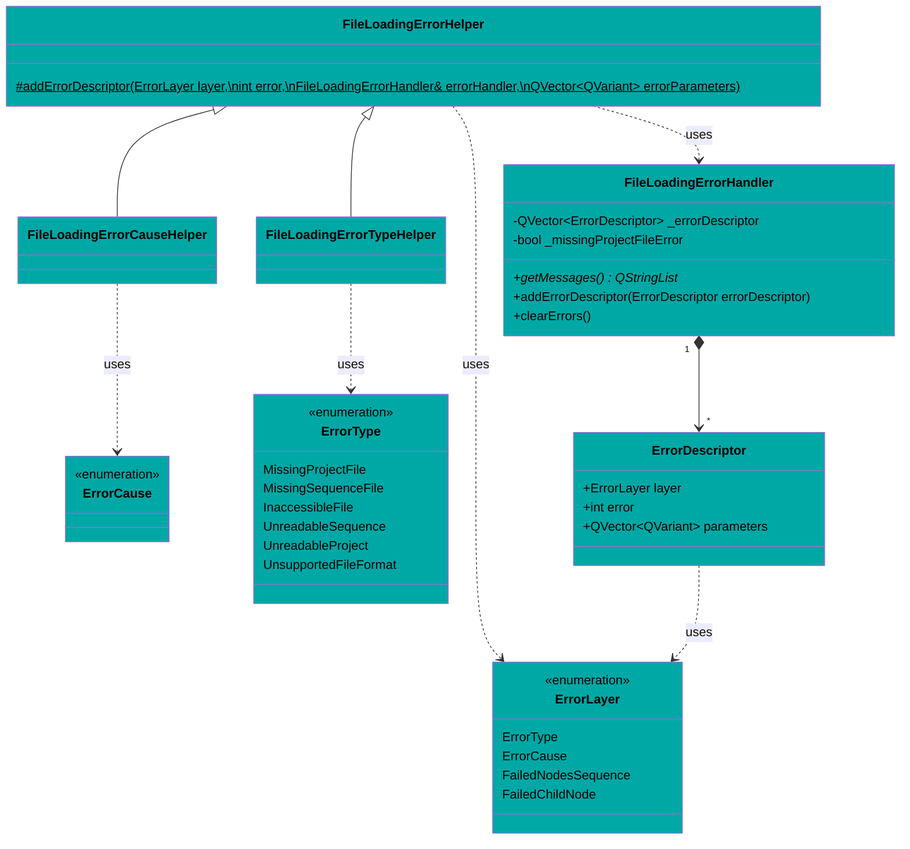

<!--
SPDX-FileCopyrightText: 2024 Benoit Rolandeau <benoit.rolandeau@allcircuits.com>

SPDX-License-Identifier: LicenseRef-ALLCircuits-ACT-1.1
-->

# Test bed core documentation

## Table of contents

- [Test bed core documentation](#test-bed-core-documentation)
  - [Table of contents](#table-of-contents)
  - [Introduction](#introduction)
  - [Class diagram](#class-diagram)
    - [Errors](#errors)
    - [Logs](#logs)
    - [Parsers](#parsers)
    - [Types](#types)
    - [Utility](#utility)
    - [Others](#others)

## Introduction

This file contains the definition of the interface between the plugins and test bed lib

## Class diagram

### Errors

### Logs

### Parsers

### Types

### Utility

### Others

