<!--
SPDX-FileCopyrightText: 2024 Benoit Rolandeau <benoit.rolandeau@allcircuits.com>

SPDX-License-Identifier: LicenseRef-ALLCircuits-ACT-1.1
-->

# Test bed lib architecture documentation

## Table of contents

- [Test bed lib architecture documentation](#test-bed-lib-architecture-documentation)
  - [Table of contents](#table-of-contents)
  - [Preamble](#preamble)
  - [Architecture](#architecture)
    - [Main classes](#main-classes)
    - [Plugins management](#plugins-management)
    - [Settings management](#settings-management)
    - [Database management](#database-management)
    - [Authentication management](#authentication-management)
    - [Permission management](#permission-management)
    - [Errors management](#errors-management)
    - [File loading management](#file-loading-management)
    - [Project management](#project-management)
      - [Project manager](#project-manager)
      - [Nodes sequences](#nodes-sequences)
      - [References nodes](#references-nodes)
      - [Sequences nodes](#sequences-nodes)
      - [Decisional transitions](#decisional-transitions)

## Preamble

This file contains the test bed lib architecture documentation.

`banks` and `plugins` are synonyms here. We created the name `banks` to not mistake

## Architecture

### Main classes

This shows the top and entry classes of the Test Bed core lib.

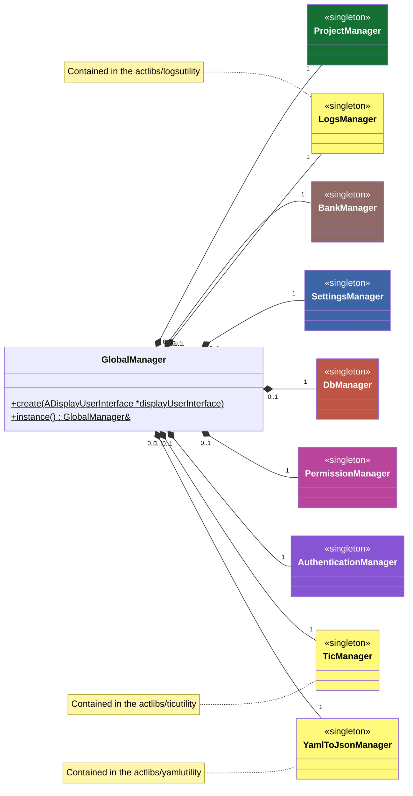

### Plugins management

First see the interface between the `plugins` and `test bed lib`:
[plugin core api](PLUGIN_CORE_API_doc.md)

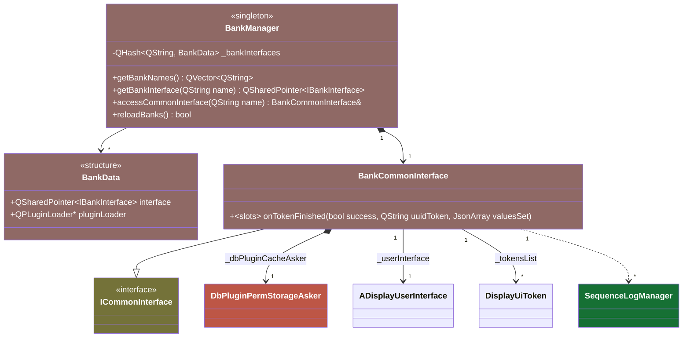

### Settings management

This describes the classes used to manage the library settings.

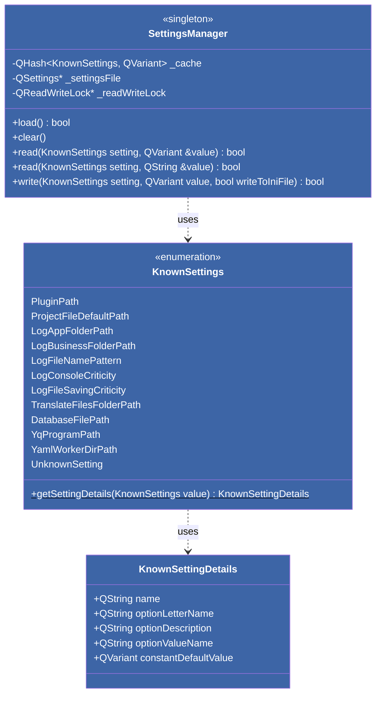

### Database management

This is the ERB diagram of the library internal database.

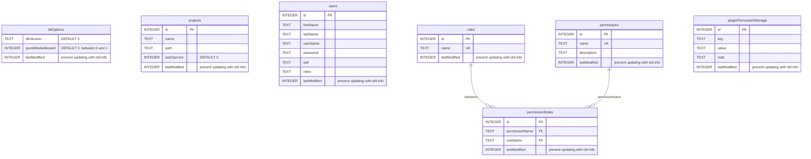

Those are the classes used to manage the access in the local database (CRUD).

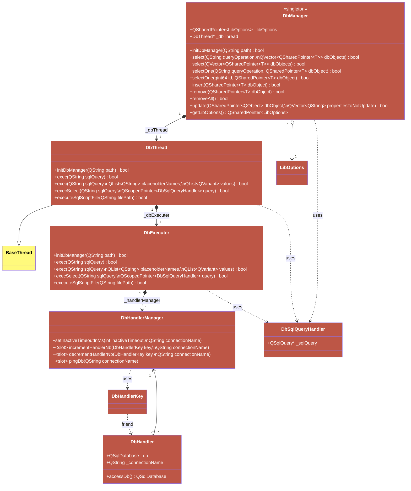

This diagram contains:
- The classes which represent the database entities
- The "Askers" classes which easify the DB requests

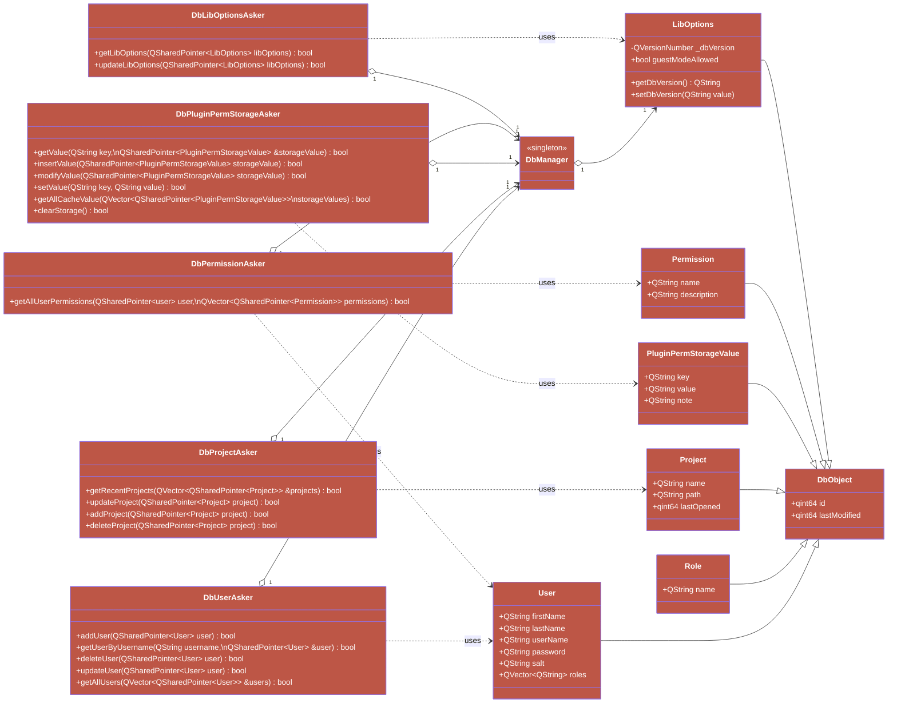

### Authentication management

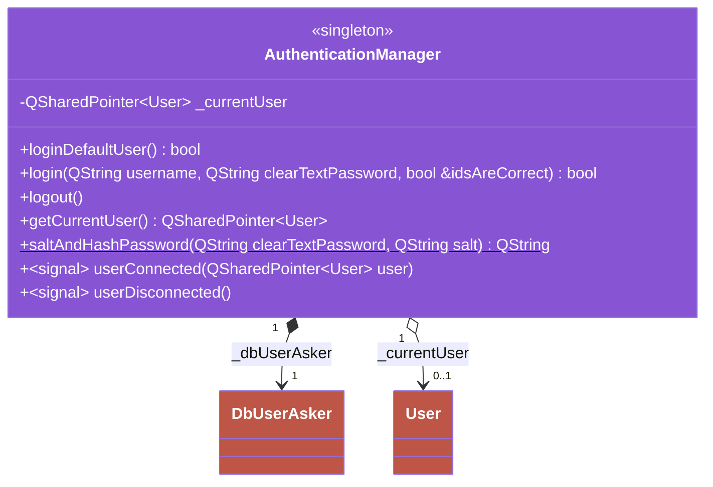

### Permission management

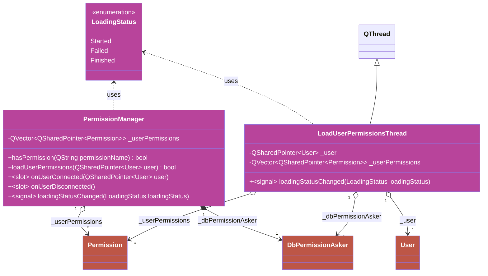

### Errors management

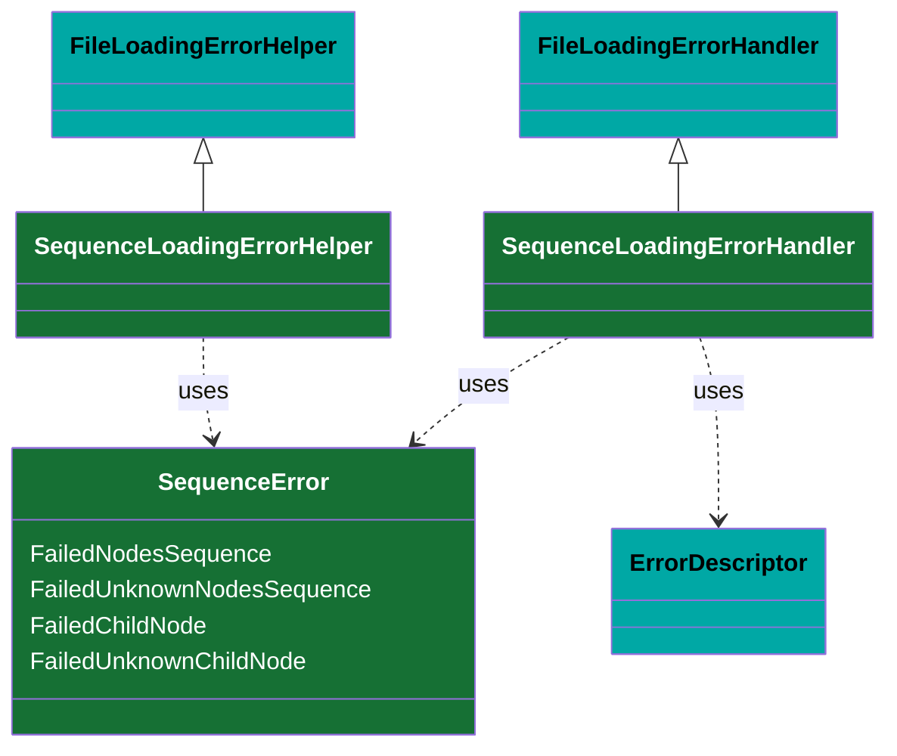

### File loading management

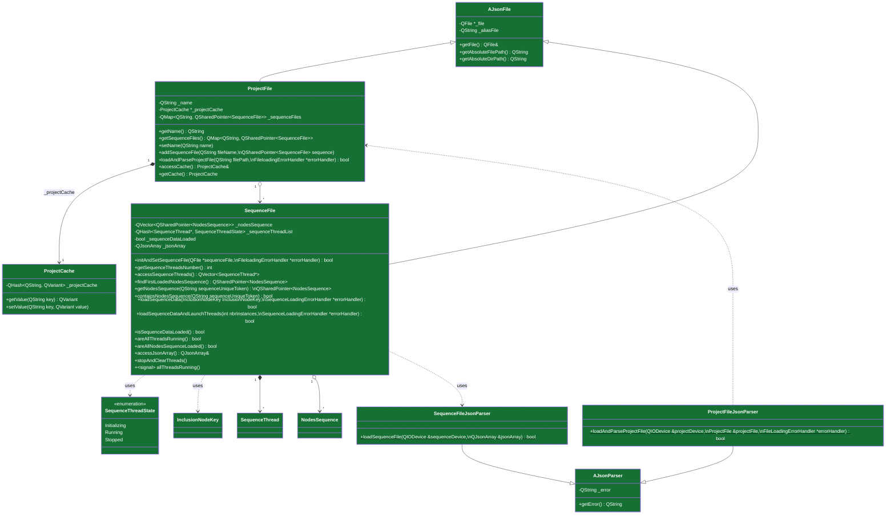

### Project management

#### Project manager

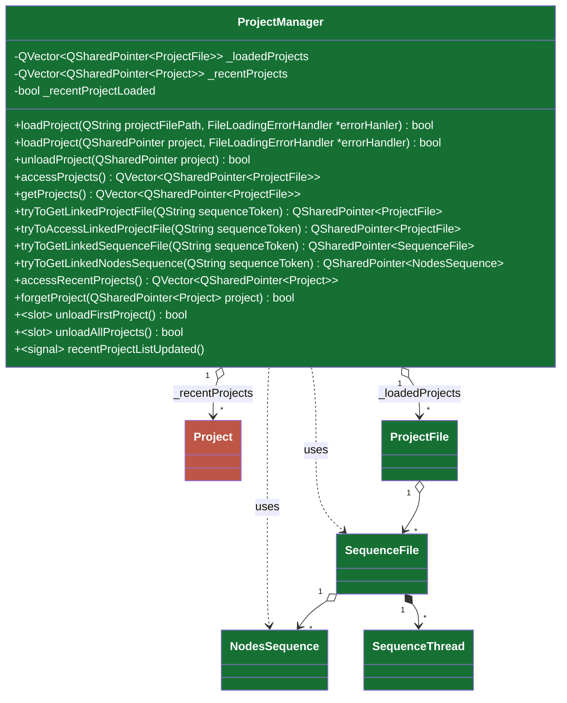

#### Nodes sequences

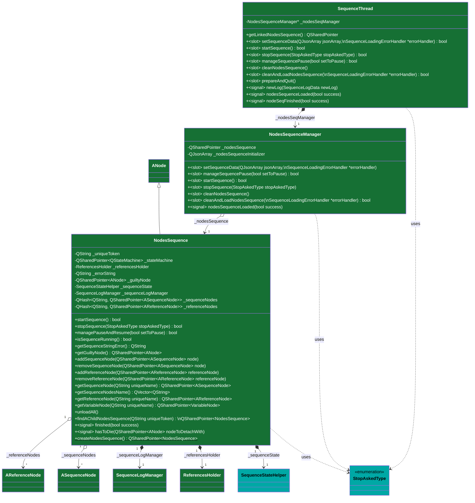

#### References nodes

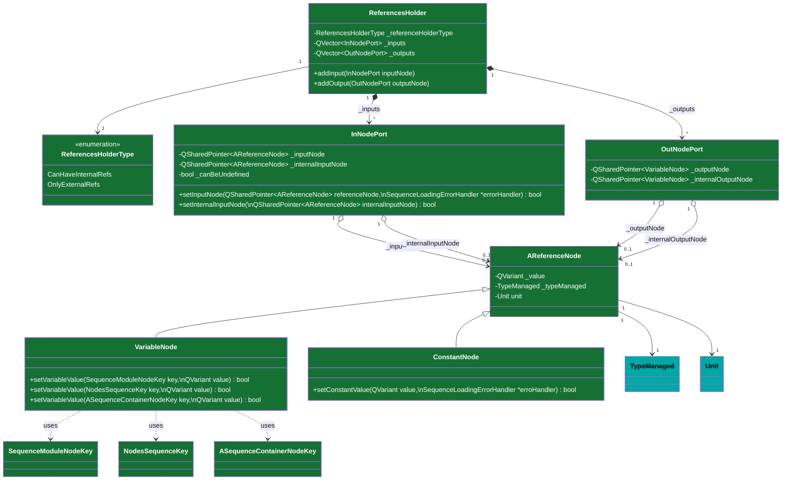

#### Sequences nodes

```mermaid
classDiagram
    direction TB

    class ANode {
        -QString _instanceName
        -QString _description
        -NodeType _nodeType
        -QSharedPointer~NodesSequence~ _parent

        #~slot~ forgetAllAboutIt(QSharedPointer~ANode~ nodeToDetachWith)*

        +~~signal~ newLog(SequenceLogData newLog)
    }
    style ANode fill:#167034,color:#fff

    class ASequenceNode {
        -bool _isActive
        -QAbstractState* _state

        +canItBeTargeted() TargetType*
        +canTargetNode() TargetType*
        +addTransitionToThisNode(QState& state,\nASequenceNode &callerNode,\nTargetingSequenceNodesKey targetingKey,\nQAbstractTransition *transition) QAbstractTransition&*

        +removeTransitionWithThisNode(ASequenceNode &callerNode,\nTargetingSequenceNodesKey targetingKey) bool
        +changeParentStateIfDifferentWithWaterfallEffect(\nQState *parentStateToCompareWith,\nASequenceNode &callerNode,\nQPointer~QAbstractState~ modifiedTargetedState,\nTargetingSequenceNodesKey targetingKey) bool
        +isActive() bool

        #nodeActivity()*
        #changeParentStateWithWaterfallEffect(QState* parentState,\nASequenceNode &callerNode,\nQPointer<QAbstractState> &modifiedTargetedState) bool*

        +~signal~ exit()
        +~signal~ error(ANode guiltyNode, QString error)
    }
    style ASequenceNode fill:#167034,color:#fff

    class NodeType {
        <<enumeration>>
        NodesSequence
        InitialNode
        JoinNode
        MergeNode
        FinalNode
        SequenceModuleNode
        VariableNode
        ConstantNode
        ForkNode
        DecisionalNode
        GroupNode
        InclusionNode
        UnknownNode
    }
    style NodeType fill:#167034,color:#fff

    class ATargetingNode {
        -QAbstractTransition *_transition
        -QSharedPointer~ASequenceNode~ _targetedNode

        +addTransitionToNode(QSharedPointer~ASequenceNode~ targetingNode) bool
        +removeTransitionToNode() bool
    }
    style ATargetingNode fill:#167034,color:#fff

    class ASequenceContainerNode {
        -bool _failIfAnErrorOccurred

        +getChildNodesSequence() QSharedPointer~NodesSequence~*

        #preparingSequenceBeforeStart(QString &error) bool
        #forgetAllAboutMe()

        #~slot~ onChildNodesSequenceFinished(bool success)
    }
    style ASequenceContainerNode fill:#167034,color:#fff

    class GroupNode {
        -QSharedPointer~NodesSequence~ _nodesSequence

        +setNodesSequence(QSharedPointer~NodesSequence~ nodesSequence)
    }
    style GroupNode fill:#167034,color:#fff

    class InclusionNode {
        -QString _sequenceFileName
        -SequenceFile* _sequenceFile
        -NodesSequenceManager* _nodesSequenceManager

        +setAndLoadSequenceFile(QString filePath,\nSequenceLoadingErrorHandler* errorHandler) bool
    }
    style InclusionNode fill:#167034,color:#fff

    class DecisionalNode {
        -QSharedPointer~AReferenceNode~ _refNodeToTest
        -QSharedPointer~ASequenceNode~ _defaultNode
        -QAbstractTransition *_defaultTransition
        -QHash~QSharedPointer~ASequenceNode~#44; TransitionInfos~ _transitions

        +setReferenceNodeToTest(QSharedPointer~AReferenceNode~ refNodeToTest)
        +setDefaultNode(QSharedPointer~ASequenceNode~ defaultNode) bool
        +addTransitionToNode(QSharedPointer~ASequenceNode~ targetedNode,\nJsonObject transitionElem,\nSequenceLoadingErrorHandler *errorHandler) bool
        +getTransitions(JsonArray &transitionsElems) bool
        +getLinkedNodes() QVector~QSharedPointer~ASequenceNode~~
        +removeTransitionToNode(QSharedPointer~ASequenceNode~ targetedNode) bool
    }
    style DecisionalNode fill:#167034,color:#fff

    class ForkNode {
        -QHash~QSharedPointer~ASequenceNode~#44; ParallelChildState~ _transitions
        -QSharedPointer~JoinNode~ _joinNodeLinked
        -QAbstractTransition *_joinNodetransition

        +addTransitionToNode(QSharedPointer~ASequenceNode~ targetedNode) bool
        +removeTransitionToNode(QSharedPointer~ASequenceNode~ targetedNode) bool
        +setJoinNodeLinked(QSharedPointer~JoinNode~ joinNode,\nQSharedPointer~ForkNode~ thisForkNode) bool
        +getJoinNodeLinked() QSharedPointer~JoinNode~ joinNode
    }
    style ForkNode fill:#167034,color:#fff

    class JoinNode {
        -QSharedPointer~ForkNode~ _forkNode
        -QHash~ASequenceNode*, QFinalState*~ _finalNodes

        +setForkNodeLinked(QState &forkState,\nQSharedPointer~ForkNode~ forkNode,\nForkNodeKey forkNodeKey) QAbstractTransition*
        +removeForkNodeLinked() bool
    }
    style JoinNode fill:#167034,color:#fff

    class SequenceModuleNode {
        -QString _bankName
        -QString _moduleName
        -ReferencesHolder _referencesHolder
        -ISequenceInstanceModule* _sequenceItfModule
        -bool _enable

        +setSequenceBankIft(ISequenceInstanceModule *seqBankItf,\nSequenceLoadingErrorHandler *errorhandler) bool
    }
    style SequenceModuleNode fill:#167034,color:#fff

    class InitialNode
    style InitialNode fill:#167034,color:#fff

    class MergeNode
    style MergeNode fill:#167034,color:#fff

    class FinalNode
    style FinalNode fill:#167034,color:#fff

    class TransitionInfos {
        +TestResult testResult
        +ADecisionalTransition* transition
    }
    style TransitionInfos fill:#167034,color:#fff

    class TestResult {
        <<enumeration>>
        NotPerformed
        Success
        Failed
    }
    style TestResult fill:#167034,color:#fff

    class AReferenceNode {
    }
    style AReferenceNode fill:#167034,color:#fff

    class VariableNode {
    }
    style VariableNode fill:#167034,color:#fff

    class ConstantNode {
    }
    style ConstantNode fill:#167034,color:#fff

    class ParallelChildState {
        +QAbstractTransition *transition
        +QStateMachine *child
        +QState *initialChildOfChild
    }
    style ParallelChildState fill:#167034,color:#fff

    class TargetType {
        <<enumeration>>
        None
        OnlyOne
        Multiple
    }
    style TargetType fill:#167034,color:#fff

    class TargetingSequenceNodesKey
    style TargetingSequenceNodesKey fill:#167034,color:#fff

    class SequenceLogData
    style SequenceLogData fill:#00A8A5,color:#000

    class SequenceFile
    style SequenceFile fill:#167034,color:#fff

    class NodesSequenceManager
    style NodesSequenceManager fill:#167034,color:#fff

    class ReferencesHolder
    style ReferencesHolder fill:#167034,color:#fff

    class ISequenceInstanceModule
    style ISequenceInstanceModule fill:#747239,color:#fff

    ANode <|-- ASequenceNode
    ASequenceNode <|-- ForkNode
    ASequenceNode <|-- FinalNode
    ASequenceNode ..> TargetType: uses
    ASequenceNode ..> TargetingSequenceNodesKey: uses
    ASequenceNode <|-- ATargetingNode
    ASequenceNode <|-- DecisionalNode
    ATargetingNode "1" o--> "1" ASequenceNode : _targetedNode
    ATargetingNode <|-- JoinNode
    ATargetingNode <|-- ASequenceContainerNode
    ATargetingNode <|-- SequenceModuleNode
    ATargetingNode <|-- MergeNode
    ATargetingNode <|-- InitialNode
    ASequenceContainerNode <|-- GroupNode
    ASequenceContainerNode <|-- InclusionNode
    InclusionNode "1" *--> "1" SequenceFile : _sequenceFile
    InclusionNode "1" *--> "1" NodesSequenceManager : _nodesSequenceManager
    InclusionNode "1" *--> "1" NodesSequenceManager : _nodesSequenceManager
    ANode ..> SequenceLogData : uses
    ANode "1" *--> "1" NodeType : _nodeType
    ANode <|-- AReferenceNode
    AReferenceNode <|-- VariableNode
    AReferenceNode <|-- ConstantNode
    TransitionInfos ..> TestResult : uses
    DecisionalNode ..> TransitionInfos : uses
    DecisionalNode "1" --> "1" AReferenceNode : _refNodeToTest
    ForkNode "1" *--> "*" ParallelChildState
    ForkNode "0..1" -- "0..1" JoinNode
    SequenceModuleNode "1" *--> "1" ISequenceInstanceModule: _sequenceItfModule
    SequenceModuleNode "1" *--> "1" ReferencesHolder: _referencesHolder
```

#### Decisional transitions

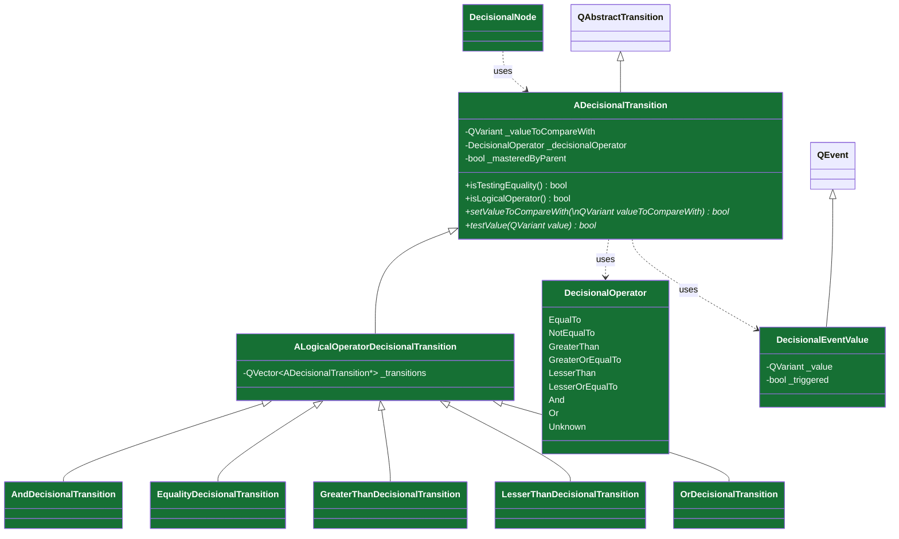
