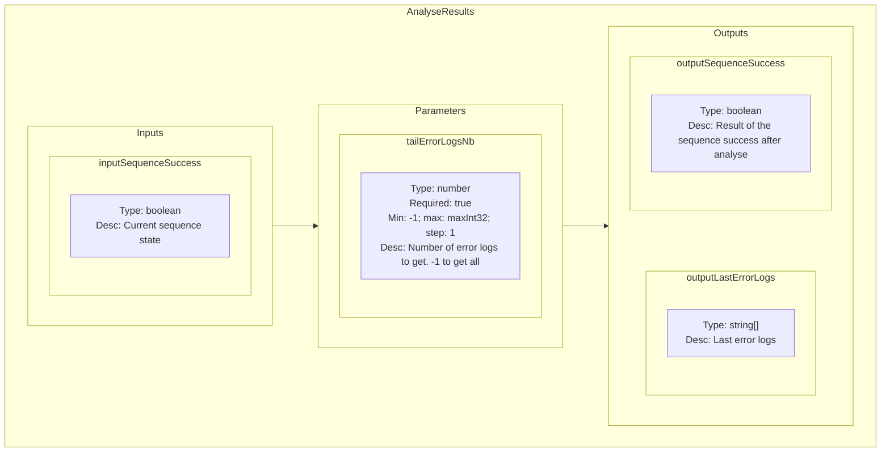
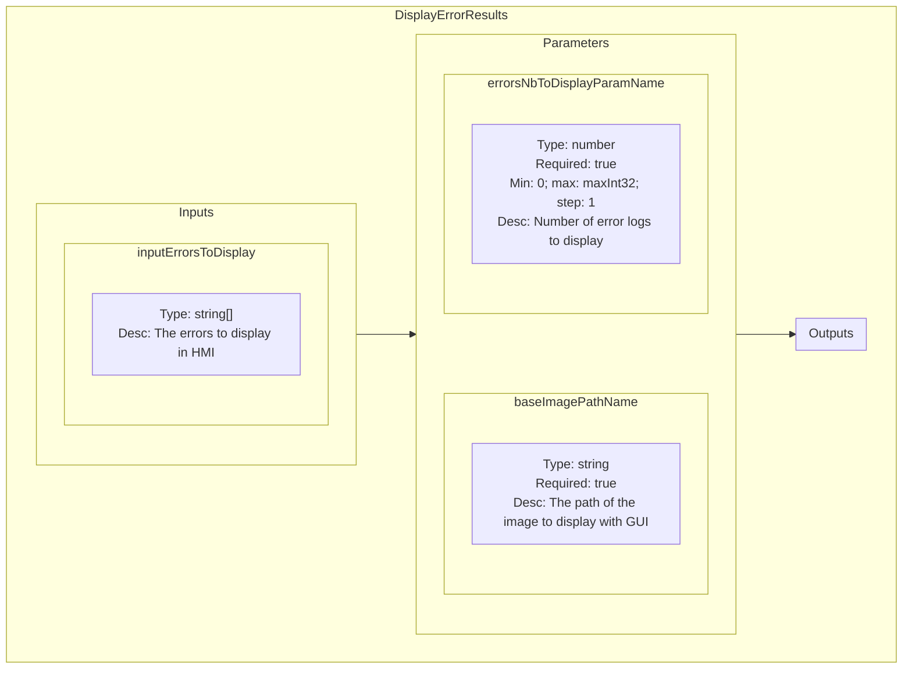

<!--
SPDX-FileCopyrightText: 2024 Benoit Rolandeau <benoit.rolandeau@allcircuits.com>

SPDX-License-Identifier: LicenseRef-ALLCircuits-ACT-1.1
-->

# Analyse results plugin

## Table of contents

- [Analyse results plugin](#analyse-results-plugin)
  - [Table of contents](#table-of-contents)
  - [Presentation](#presentation)
  - [Modules list](#modules-list)
    - [AnalyseResults](#analyseresults)
      - [Presentation](#presentation-1)
      - [Schematic representation](#schematic-representation)
    - [DisplayErrorResults](#displayerrorresults)
      - [Presentation](#presentation-2)
      - [Schematic representation](#schematic-representation-1)

## Presentation

This plugin contains modules used to give meanings on results.

## Modules list

### AnalyseResults

#### Presentation

The module says if an error occured because a module failed or a business error log occured (a log
with warning level).

This module is used to analyse the result of a group of modules, two scenarios are tested. But for
all, the last sequence logs (number of logs to get is given by a parameter) are retrieved:
- If the "inputSequenceSuccess" input value is equals to "True", the module will get the business
  sequence logs in errors, if at least one is an error we detect that an error occured
- If the "inputSequenceSuccess" input value is equals to "False", the module will get the business
  sequence logs in errors

#### Schematic representation

### DisplayErrorResults

#### Presentation

Display the last error results and wait the user to remove the board from the test bed.

We wait the user to explicitly remove its board from the test bench.

#### Schematic representation

