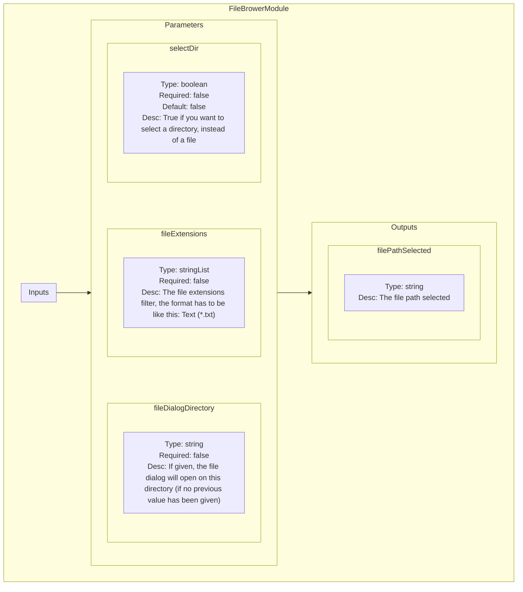
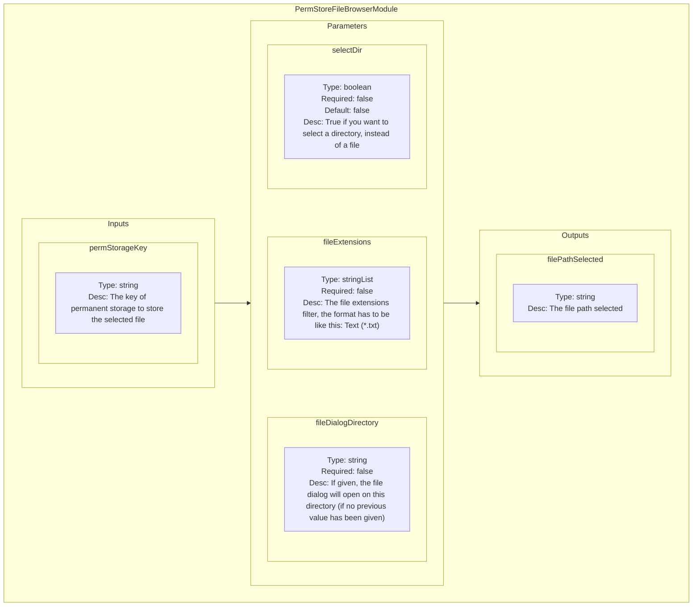
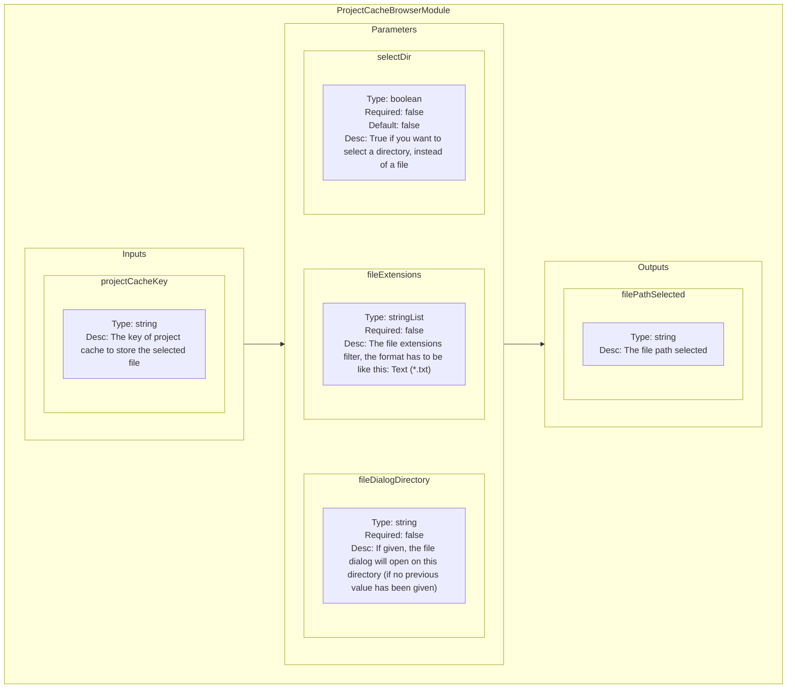

<!--
SPDX-FileCopyrightText: 2024 Benoit Rolandeau <benoit.rolandeau@allcircuits.com>

SPDX-License-Identifier: LicenseRef-ALLCircuits-ACT-1.1
-->

# File Browser plugin

## Table of contents

- [File Browser plugin](#file-browser-plugin)
  - [Table of contents](#table-of-contents)
  - [Presentation](#presentation)
  - [Modules list](#modules-list)
    - [FileBrowerModule](#filebrowermodule)
      - [Presentation](#presentation-1)
      - [Schematic representation](#schematic-representation)
    - [PermStoreFileBrowserModule](#permstorefilebrowsermodule)
      - [Presentation](#presentation-2)
      - [Schematic representation](#schematic-representation-1)
    - [ProjectCacheBrowserModule](#projectcachebrowsermodule)
      - [Presentation](#presentation-3)
      - [Schematic representation](#schematic-representation-2)

## Presentation

This plugin contains modules for displaying a file browser to user.

## Modules list

### FileBrowerModule

#### Presentation

Simple module to browse file or folder (without getting or saving anything).

#### Schematic representation

### PermStoreFileBrowserModule

#### Presentation

Useful module to browse file and store the value got in the permanent storage.
The module memorizes in permanent storage the path chosen, and will reload it at start.

#### Schematic representation

### ProjectCacheBrowserModule

#### Presentation

Useful module to browse file and store the value got in the project cache.
he module memorizes in project cache the path chosen, and will reload it at start.
The project cache is only alive until the user closes the current project or close the apps.

#### Schematic representation

