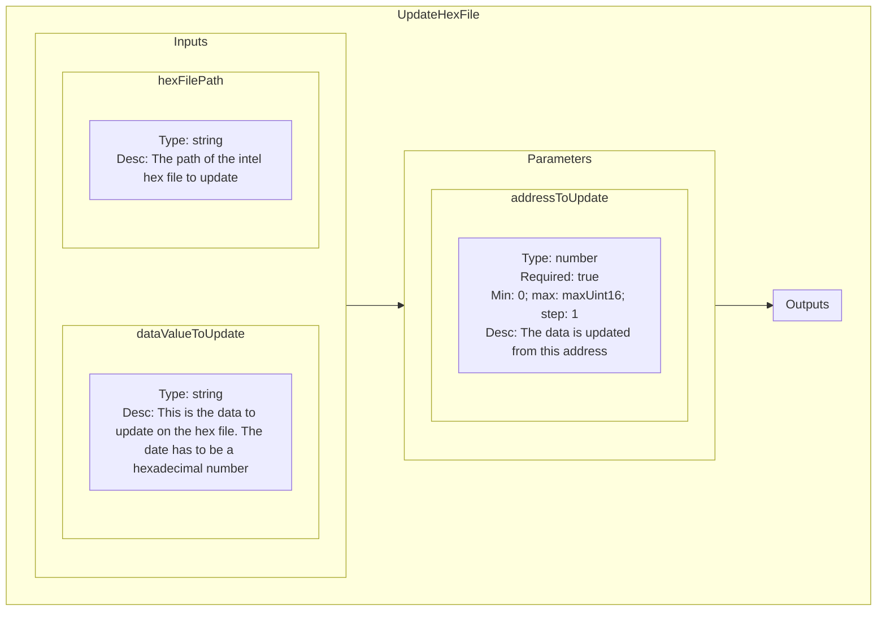

<!--
SPDX-FileCopyrightText: 2024 Benoit Rolandeau <benoit.rolandeau@allcircuits.com>

SPDX-License-Identifier: LicenseRef-ALLCircuits-ACT-1.1
-->

# Intel Hex File plugin

## Table of contents

- [Intel Hex File plugin](#intel-hex-file-plugin)
  - [Table of contents](#table-of-contents)
  - [Presentation](#presentation)
  - [Modules list](#modules-list)
    - [UpdateHexFile](#updatehexfile)
      - [Presentation](#presentation-1)
      - [Schematic representation](#schematic-representation)

## Presentation

This plugin contains modules which help to manage "hex" files.

## Modules list

### UpdateHexFile

#### Presentation

This module is useful to update the content of a hex file.

The address is given by parameter and the value by input.

#### Schematic representation

