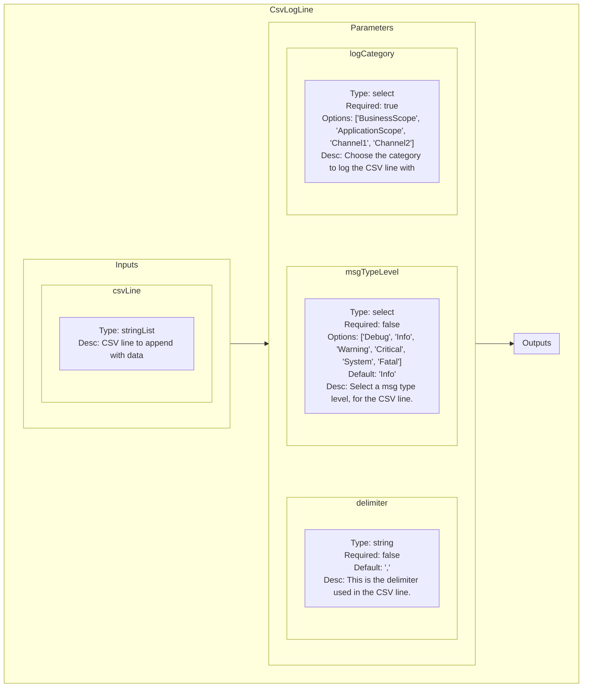
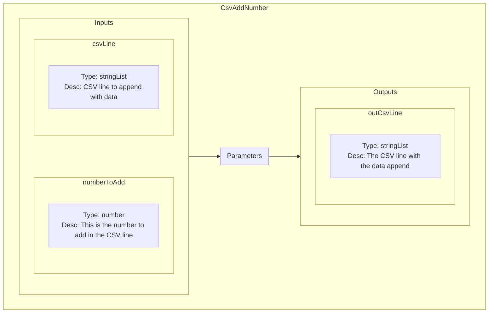
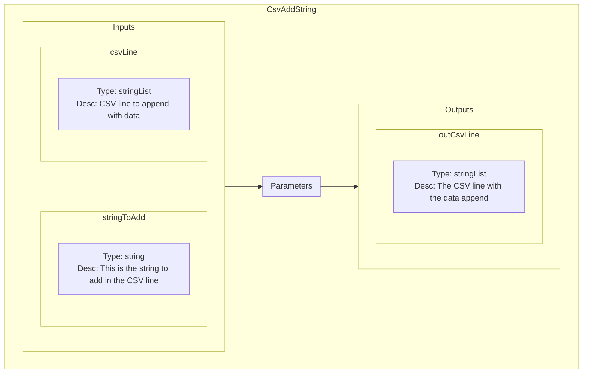
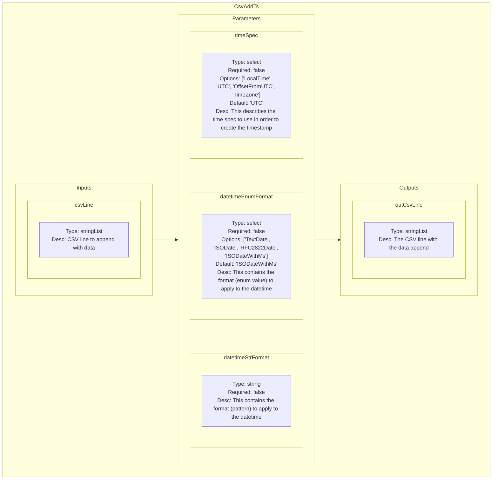
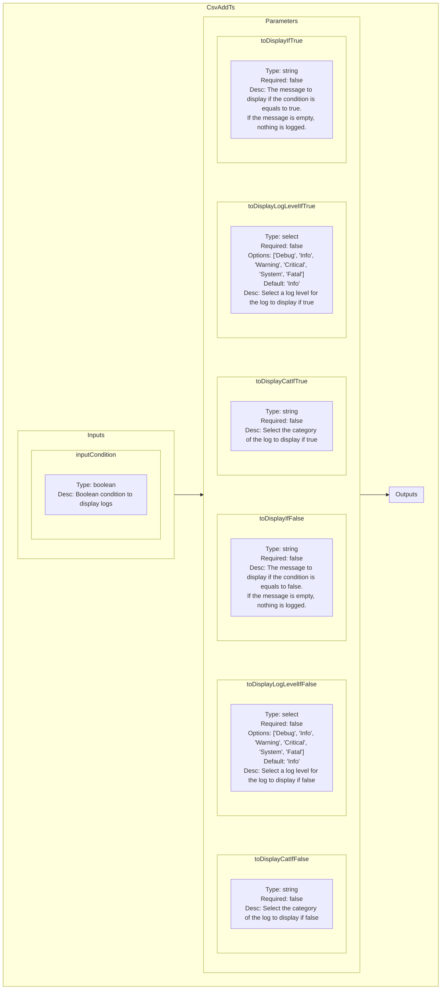

```mermaid
flowchart LR
    subgraph "OnlyOneFile"
        direction LR
        subgraph "Inputs"
            direction TB
            subgraph Input1[inputLogsFolder]
                direction TB
                Input1Info["Type: string\nDesc: This is the folder where the logs file will be stored."]
            end
        end
        subgraph "Parameters"
            direction TB
            subgraph Param1[maxFolderSize]
                direction TB
                Param1Info["Type: number\nRequired: true\nDefault: -1\nMin: -1; max: maxInt32; step: 1\nDesc: The max folder size in Mo, after this size, the oldest logs files will be removed"]
            end
            subgraph Param2[logsCategoryFilter]
                direction TB
                Param2Info["Type: checkBoxList\nRequired: true\nOptions: ['BusinessScope', 'ApplicationScope', 'Channel1', 'Channel2']\nDefault: ['BusinessScope', 'ApplicationScope', 'Channel1', 'Channel2']\nDesc: Choose the category of logs to save in file"]
            end
            subgraph Param3[msgTypeLevel]
                direction TB
                Param3Info["Type: select\nRequired: true\nOptions: ['Debug', 'Info', 'Warning', 'Critical', 'System', 'Fatal']\nDefault: 'Info'\nDesc: Select a msg type level, all the elements above and equal to this level will be saved in file"]
            end
            subgraph Param4[logFileStateLevel]
                direction TB
                Param4Info["Type: select\nRequired: false\nOptions: ['Debug', 'Info', 'Warning', 'Critical', 'System', 'Fatal']\nDefault: 'Fatal'\nDesc: Set the log level for the logFileState feature"]
            end
            subgraph Param5[logsFileSuffix]
                direction TB
                Param5Info["Type: string\nRequired: true\nDefault: '.log'\nDesc: Give the logs file suffix"]
            end
            subgraph Param6[fileCreationBehavior]
                direction TB
                Param6Info["Type: select\nRequired: true\nOptions: ['createAtFirstLogKey', 'createImmediatelyKey']\nDefault: 'createImmediatelyKey'\nDesc: Select a behavior to manage logs file creation"]
            end
            subgraph Param7[logFormatType]
                direction TB
                Param7Info["Type: select\nRequired: false\nOptions: ['DisplayAll', 'OnlyDisplayMsg']\nDefault: 'DisplayAll'\nDesc: The logs format type to use in the file"]
            end
            subgraph Param8[enableLogFileState]
                direction TB
                Param8Info["Type: boolean\nRequired: false\nDefault: false\nDesc: If true, it's possible to prepend a log to the log file and/or append a suffix to the log file name\nif at least one log is above the level given.\nThe same things are possible if at log file closing, the level was never reached."]
            end
            subgraph Param9[logFileStateMsgToPrependIfUnderLevel]
                direction TB
                Param9Info["Type: string\nRequired: false\nDesc: If not empty, if the feature is enabled and no log msg have never\nexceeded the level defined, this message will be added at the start of\nthe log file at it's closing."]
            end
            subgraph Param10[logFileStateToAddToFileNameIfUnderLevel]
                direction TB
                Param10Info["Type: string\nRequired: false\nDesc: If not empty, if the feature is enabled and no log msg have never\nexceeded the level defined, this string will be appended to the log\nfile base name at it's closing."]
            end
            subgraph Param11[logFileStateMsgToPrependIfAboveLevel]
                direction TB
                Param11Info["Type: string\nRequired: false\nDesc: If not empty, if the feature is enabled and at least one log msg\nhas exceeded the level defined, this message will be added once at the\nstart of the log file, when the log has been received."]
            end
            subgraph Param12[logFileStateToAddToFileNameIfAboveLevel]
                direction TB
                Param12Info["Type: string\nRequired: false\nDesc: If not empty, if the feature is enabled and at least one log msg\nhas exceeded the level defined, this string will be appended once to the\nlog file base name  at the start of the log file, when the log has been\nreceived."]
            end
            Param1 ~~~ Param2
            Param2 ~~~ Param3
            Param3 ~~~ Param4
            Param4 ~~~ Param5
            Param5 ~~~ Param6
            Param6 ~~~ Param7
            Param7 ~~~ Param8
            Param8 ~~~ Param9
            Param9 ~~~ Param10
            Param10 ~~~ Param11
            Param11 ~~~ Param12
        end
        subgraph "Outputs"
        end
        Inputs --> Parameters
        Parameters --> Outputs
    end
```

<!--
SPDX-FileCopyrightText: 2024 Benoit Rolandeau <benoit.rolandeau@allcircuits.com>

SPDX-License-Identifier: LicenseRef-ALLCircuits-ACT-1.1
-->

# Logging plugin

## Table of contents

- [Logging plugin](#logging-plugin)
  - [Table of contents](#table-of-contents)
  - [Presentation](#presentation)
  - [Modules list](#modules-list)
    - [CsvLogLine](#csvlogline)
      - [Presentation](#presentation-1)
      - [Schematic representation](#schematic-representation)
    - [CsvAddNumber](#csvaddnumber)
      - [Presentation](#presentation-2)
      - [Schematic representation](#schematic-representation-1)
    - [CsvAddString](#csvaddstring)
      - [Presentation](#presentation-3)
      - [Schematic representation](#schematic-representation-2)
    - [CsvAddTs](#csvaddts)
      - [Presentation](#presentation-4)
      - [Schematic representation](#schematic-representation-3)
    - [LogMsgByBoolCondition](#logmsgbyboolcondition)
      - [Presentation](#presentation-5)
      - [Schematic representation](#schematic-representation-4)
    - [OneBoardOneFile](#oneboardonefile)
      - [Presentation](#presentation-6)
      - [Schematic representation](#schematic-representation-5)
    - [OnlyOneFile](#onlyonefile)
      - [Presentation](#presentation-7)
      - [Schematic representation](#schematic-representation-6)

## Presentation

This plugin contains modules which manage logs. There are several modules categories:
- Modules linked to CSV files
- Modules used to fill logs files

## Modules list

### CsvLogLine

#### Presentation

This module emits the line of a CSV in the sequence logs with the given log category.

It takes a list of string elements (each one is equal to a column value), join them with the
delimiter given to emit it.

To fill the line to emit, the other modules `CsvAdd*` have to be used.

#### Schematic representation

### CsvAddNumber

#### Presentation

This module appends a number to the string list given, which is the representation of a CSV line.

#### Schematic representation

### CsvAddString

#### Presentation

This module appends a string to the string list given, which is the representation of a CSV line.

#### Schematic representation

### CsvAddTs

#### Presentation

This module appends the current date time to the string list given, which is the representation of
a CSV line.

You can specify the expected string format of the date time to write.

If `datetimeStrFormat` isn't empty, it will be used instead of `datetimeEnumFormat`.

#### Schematic representation

### LogMsgByBoolCondition

#### Presentation

This module creates and emits a specific log message on a boolean condition.

You can specify a different message if the boolean condition is equals to true or false.

#### Schematic representation

### OneBoardOneFile

#### Presentation

This module creates a file and save all the logs linked to a specific board in it.

The file is closed and no more used at the sequence end.

#### Schematic representation

```mermaid
flowchart LR
    subgraph "OneBoardOneFile"
        direction LR
        subgraph "Inputs"
            direction TB
            subgraph Input1[inputLogsFolder]
                direction TB
                Input1Info["Type: string\nDesc: This is the folder where the logs file will be stored."]
            end
            subgraph Input2[inputSerialNumber]
                direction TB
                Input2Info["Type: string\nDesc: This is the serial number to use for creating the file"]
            end
            Input1 ~~~ Input2
        end
        subgraph "Parameters"
            direction TB
            subgraph Param1[maxFolderSize]
                direction TB
                Param1Info["Type: number\nRequired: true\nDefault: -1\nMin: -1; max: maxInt32; step: 1\nDesc: The max folder size in Mo, after this size, the oldest logs files will be removed"]
            end
            subgraph Param2[logsCategoryFilter]
                direction TB
                Param2Info["Type: checkBoxList\nRequired: true\nOptions: ['BusinessScope', 'ApplicationScope', 'Channel1', 'Channel2']\nDefault: ['BusinessScope', 'ApplicationScope', 'Channel1', 'Channel2']\nDesc: Choose the category of logs to save in file"]
            end
            subgraph Param3[msgTypeLevel]
                direction TB
                Param3Info["Type: select\nRequired: true\nOptions: ['Debug', 'Info', 'Warning', 'Critical', 'System', 'Fatal']\nDefault: 'Info'\nDesc: Select a msg type level, all the elements above and equal to this level will be saved in file"]
            end
            subgraph Param4[logFileStateLevel]
                direction TB
                Param4Info["Type: select\nRequired: false\nOptions: ['Debug', 'Info', 'Warning', 'Critical', 'System', 'Fatal']\nDefault: 'Fatal'\nDesc: Set the log level for the logFileState feature"]
            end
            subgraph Param5[logsFileSuffix]
                direction TB
                Param5Info["Type: string\nRequired: true\nDefault: '.log'\nDesc: Give the logs file suffix"]
            end
            subgraph Param6[fileCreationBehavior]
                direction TB
                Param6Info["Type: select\nRequired: true\nOptions: ['createAtFirstLogKey', 'createImmediatelyKey']\nDefault: 'createImmediatelyKey'\nDesc: Select a behavior to manage logs file creation"]
            end
            subgraph Param7[logFormatType]
                direction TB
                Param7Info["Type: select\nRequired: false\nOptions: ['DisplayAll', 'OnlyDisplayMsg']\nDefault: 'DisplayAll'\nDesc: The logs format type to use in the file"]
            end
            subgraph Param8[enableLogFileState]
                direction TB
                Param8Info["Type: boolean\nRequired: false\nDefault: false\nDesc: If true, it's possible to prepend a log to the log file and/or append a suffix to the log file name\nif at least one log is above the level given.\nThe same things are possible if at log file closing, the level was never reached."]
            end
            subgraph Param9[logFileStateMsgToPrependIfUnderLevel]
                direction TB
                Param9Info["Type: string\nRequired: false\nDesc: If not empty, if the feature is enabled and no log msg have never\nexceeded the level defined, this message will be added at the start of\nthe log file at it's closing."]
            end
            subgraph Param10[logFileStateToAddToFileNameIfUnderLevel]
                direction TB
                Param10Info["Type: string\nRequired: false\nDesc: If not empty, if the feature is enabled and no log msg have never\nexceeded the level defined, this string will be appended to the log\nfile base name at it's closing."]
            end
            subgraph Param11[logFileStateMsgToPrependIfAboveLevel]
                direction TB
                Param11Info["Type: string\nRequired: false\nDesc: If not empty, if the feature is enabled and at least one log msg\nhas exceeded the level defined, this message will be added once at the\nstart of the log file, when the log has been received."]
            end
            subgraph Param12[logFileStateToAddToFileNameIfAboveLevel]
                direction TB
                Param12Info["Type: string\nRequired: false\nDesc: If not empty, if the feature is enabled and at least one log msg\nhas exceeded the level defined, this string will be appended once to the\nlog file base name  at the start of the log file, when the log has been\nreceived."]
            end
            Param1 ~~~ Param2
            Param2 ~~~ Param3
            Param3 ~~~ Param4
            Param4 ~~~ Param5
            Param5 ~~~ Param6
            Param6 ~~~ Param7
            Param7 ~~~ Param8
            Param8 ~~~ Param9
            Param9 ~~~ Param10
            Param10 ~~~ Param11
            Param11 ~~~ Param12
        end
        subgraph "Outputs"
        end
        Inputs --> Parameters
        Parameters --> Outputs
    end
```

### OnlyOneFile

#### Presentation

This module creates a file and save all the logs in it.

A new file is created by day.

#### Schematic representation

