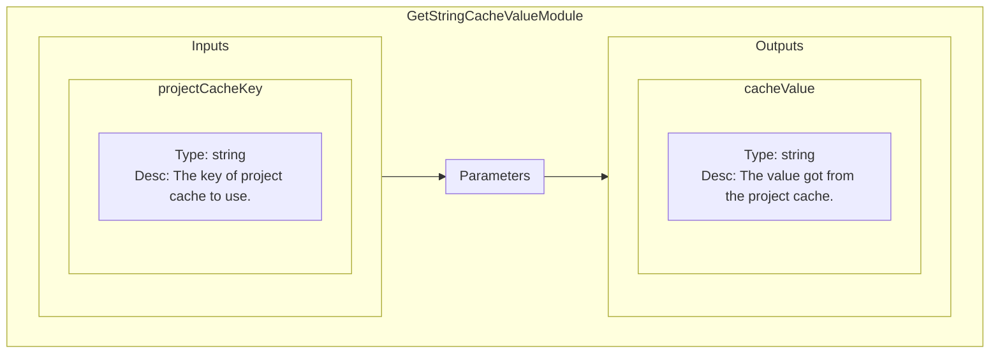
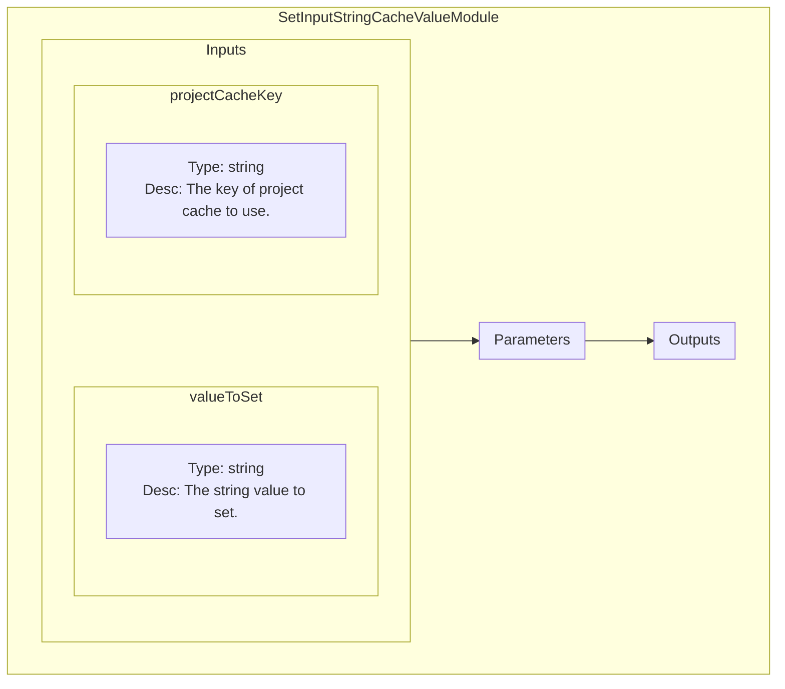
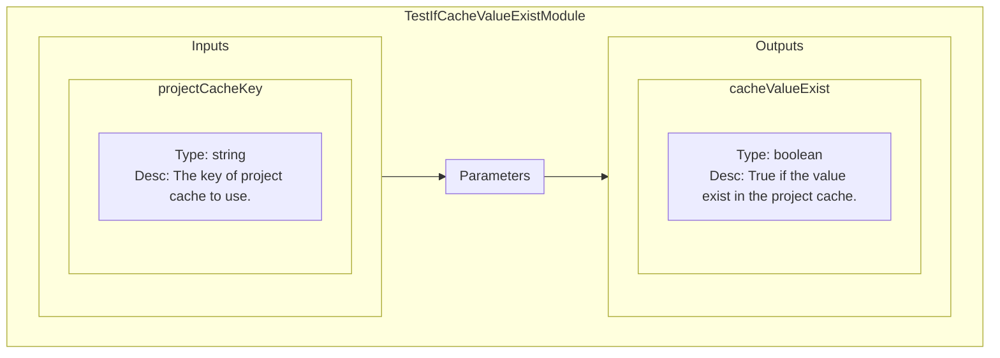

<!--
SPDX-FileCopyrightText: 2024 Benoit Rolandeau <benoit.rolandeau@allcircuits.com>

SPDX-License-Identifier: LicenseRef-ALLCircuits-ACT-1.1
-->

# Manage Storages plugin

## Table of contents

- [Manage Storages plugin](#manage-storages-plugin)
  - [Table of contents](#table-of-contents)
  - [Presentation](#presentation)
  - [Modules list](#modules-list)
    - [GetStringCacheValueModule](#getstringcachevaluemodule)
      - [Presentation](#presentation-1)
      - [Schematic representation](#schematic-representation)
    - [SetInputStringCacheValueModule](#setinputstringcachevaluemodule)
      - [Presentation](#presentation-2)
      - [Schematic representation](#schematic-representation-1)
    - [TestIfCacheValueExistModule](#testifcachevalueexistmodule)
      - [Presentation](#presentation-3)
      - [Schematic representation](#schematic-representation-2)

## Presentation

This plugin allows to get or set information from or to the project cache or permanent storage.

The project cache lives with the project (and not the sequence): when the sequence ends, the values
in the project cache are kept. However, when the project is closed, all the cache values are lost.

The permanent storage kepts information in a local database; therefore, the data stored in it are
persistents.

## Modules list

### GetStringCacheValueModule

#### Presentation

Get a string value stored in the project cache, thanks to a key.

If the given key doesn't exist in the project cache, a null string is returned.

#### Schematic representation

### SetInputStringCacheValueModule

#### Presentation

Set a string value to store in the project cache, found thanks to a key.

If no value already exists in the cache with the key, it will be created.

#### Schematic representation

### TestIfCacheValueExistModule

#### Presentation

Test if a value exist in the project cache (if not null).

#### Schematic representation

