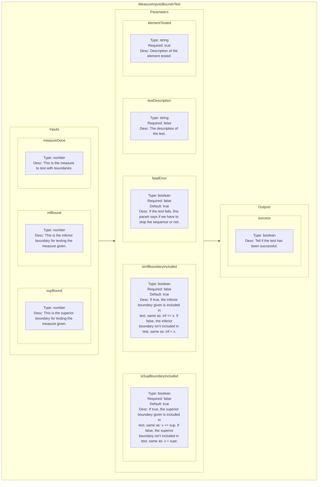
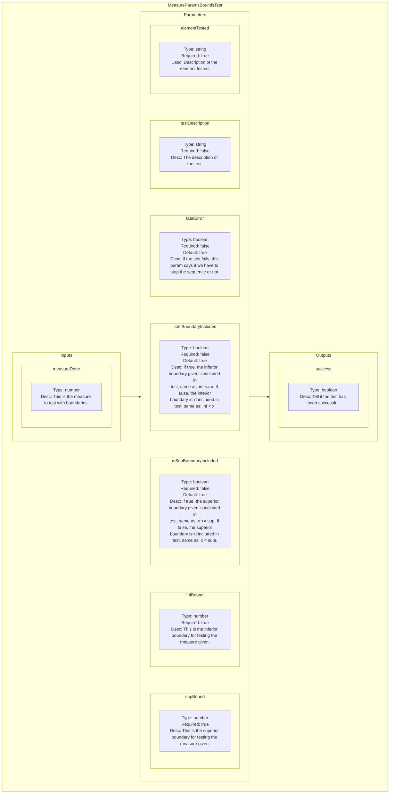

<!--
SPDX-FileCopyrightText: 2024 Benoit Rolandeau <benoit.rolandeau@allcircuits.com>

SPDX-License-Identifier: LicenseRef-ALLCircuits-ACT-1.1
-->

# Measure Compare Test plugin

## Table of contents

- [Measure Compare Test plugin](#measure-compare-test-plugin)
  - [Table of contents](#table-of-contents)
  - [Presentation](#presentation)
  - [Modules list](#modules-list)
    - [MeasureInputsBoundsTest](#measureinputsboundstest)
      - [Presentation](#presentation-1)
      - [Schematic representation](#schematic-representation)
    - [MeasureParamsBoundsTest](#measureparamsboundstest)
      - [Presentation](#presentation-2)
      - [Schematic representation](#schematic-representation-1)

## Presentation

This plugin contains modules which allows to compare values and displays logs depending of the
compare test result.

## Modules list

### MeasureInputsBoundsTest

#### Presentation

Test if the given measured value is contained in the boundaries set.

The boundaries values are got from inputs.

#### Schematic representation

### MeasureParamsBoundsTest

#### Presentation

Test if the given measured value is contained in the boundaries set.

The boundaries values are got from parameters.

#### Schematic representation

