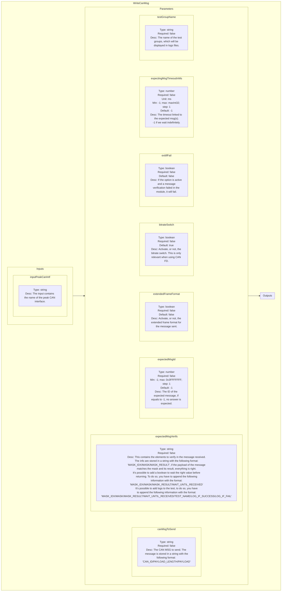
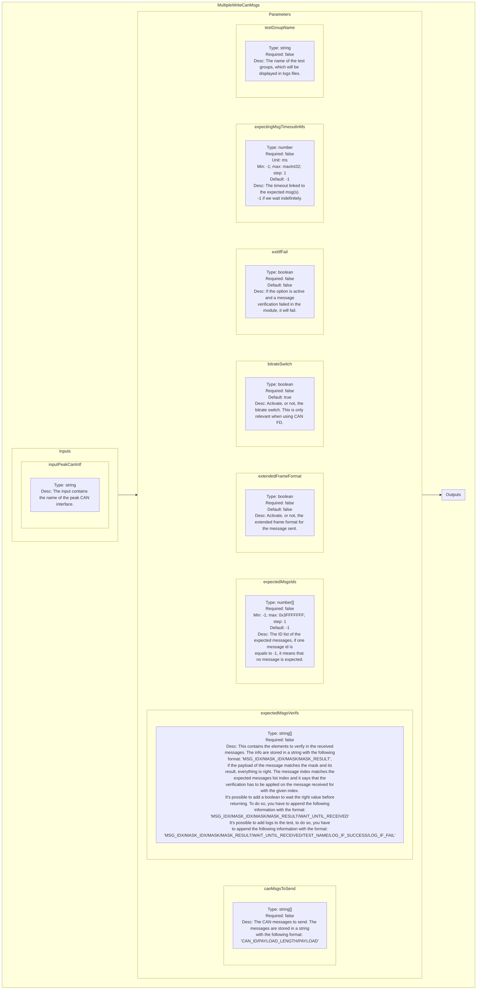
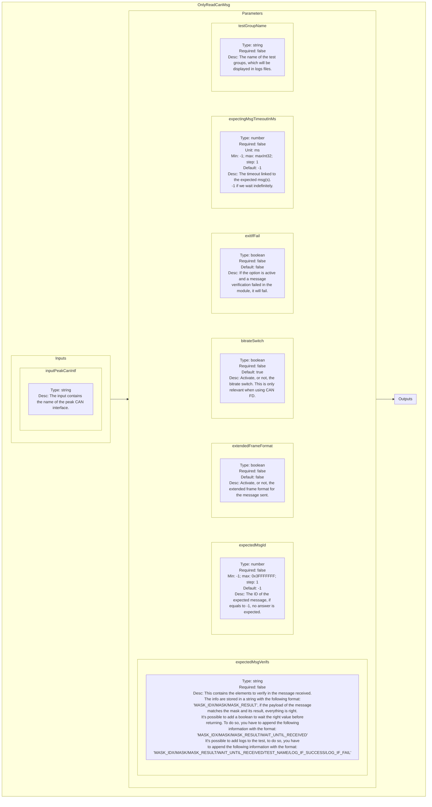
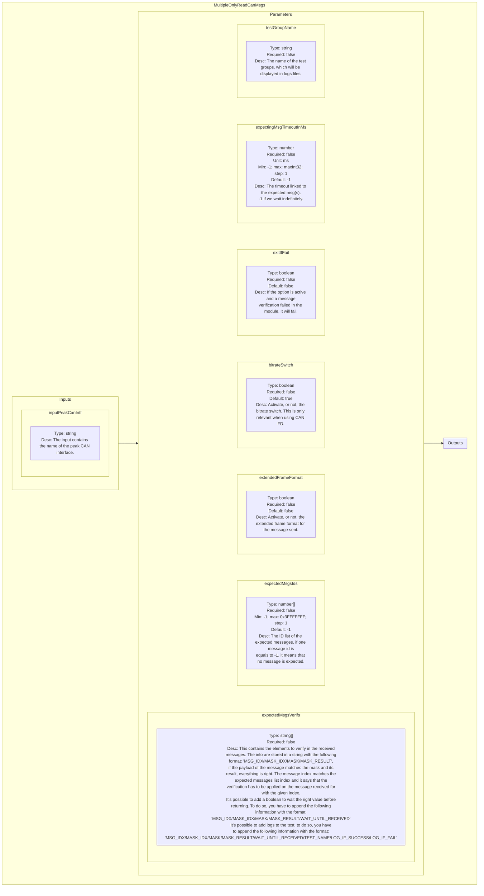
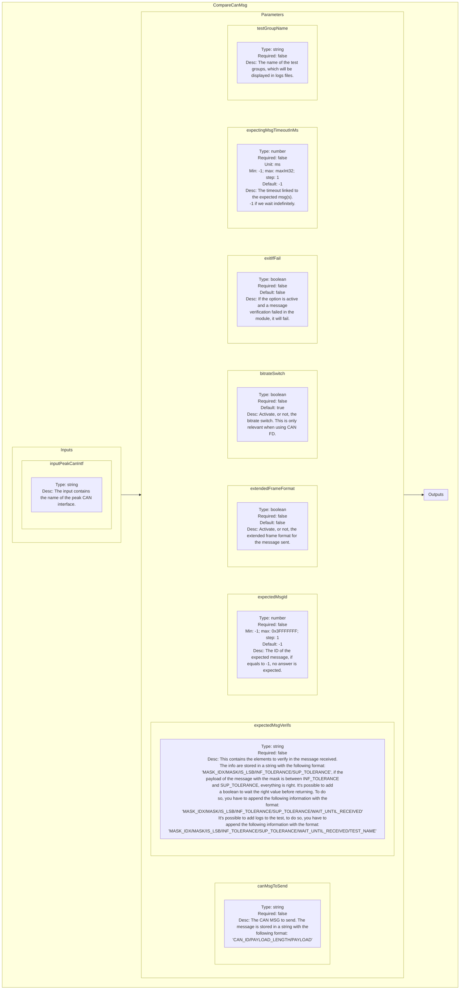
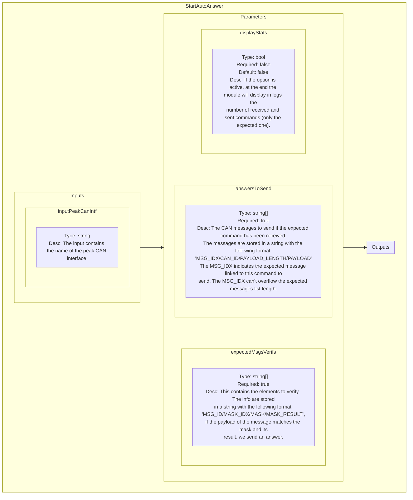
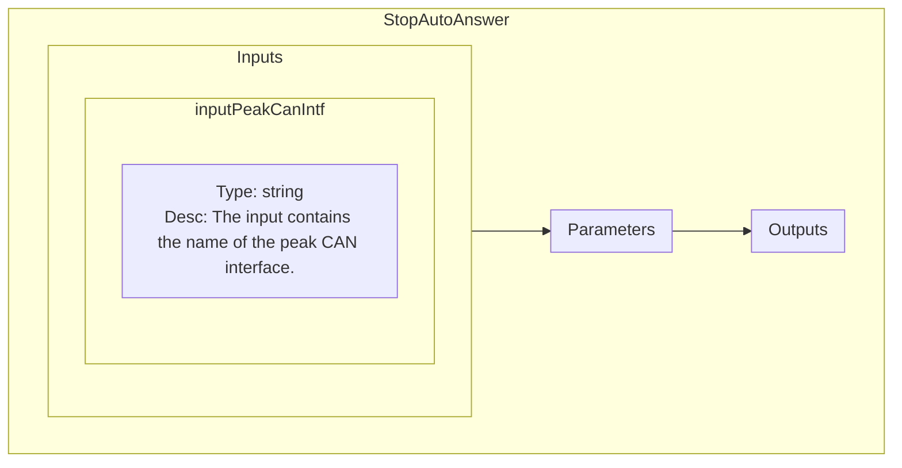

<!--
SPDX-FileCopyrightText: 2024 Benoit Rolandeau <benoit.rolandeau@allcircuits.com>

SPDX-License-Identifier: LicenseRef-ALLCircuits-ACT-1.1
-->

# Peak Can plugin

## Table of contents

- [Peak Can plugin](#peak-can-plugin)
  - [Table of contents](#table-of-contents)
  - [Presentation](#presentation)
  - [Modules list](#modules-list)
    - [WriteCanMsg](#writecanmsg)
      - [Presentation](#presentation-1)
      - [Schematic representation](#schematic-representation)
    - [MultipleWriteCanMsgs](#multiplewritecanmsgs)
      - [Presentation](#presentation-2)
      - [Schematic representation](#schematic-representation-1)
    - [OnlyReadCanMsg](#onlyreadcanmsg)
      - [Presentation](#presentation-3)
      - [Schematic representation](#schematic-representation-2)
    - [MultipleOnlyReadCanMsgs](#multipleonlyreadcanmsgs)
      - [Presentation](#presentation-4)
      - [Schematic representation](#schematic-representation-3)
    - [CompareCanMsg](#comparecanmsg)
      - [Presentation](#presentation-5)
      - [Schematic representation](#schematic-representation-4)
    - [StartAutoAnswer](#startautoanswer)
      - [Presentation](#presentation-6)
      - [Schematic representation](#schematic-representation-5)
    - [StopAutoAnswer](#stopautoanswer)
      - [Presentation](#presentation-7)
      - [Schematic representation](#schematic-representation-6)

## Presentation

This plugin contains modules to communicate in CAN with a Peak probe.

## Modules list

### WriteCanMsg

#### Presentation

This module sends a CAN message and may expect an answer.

#### Schematic representation

### MultipleWriteCanMsgs

#### Presentation

This module sends sequentially multiple CAN messages and may expect answers for each one.

#### Schematic representation

### OnlyReadCanMsg

#### Presentation

This module only waits for an expected CAN message.

#### Schematic representation

### MultipleOnlyReadCanMsgs

#### Presentation

This module waits for expected CAN messages.

#### Schematic representation

### CompareCanMsg

#### Presentation

This module sends a CAN message and extract a value from the expected answer received. The value
extracted is tested and logs are emitted.

#### Schematic representation

### StartAutoAnswer

#### Presentation

This is the start auto answer module. This module allows to start the automatic answering process
in background.

The process can be stopped by calling the [StopAutoAnswer](#stopautoanswer) module.

#### Schematic representation

### StopAutoAnswer

#### Presentation

This is the stop auto answer module. This module allows to stop the automatic answering process in
background.

The process can be started by calling the [StartAutoAnswer](#startautoanswer) module.

#### Schematic representation

