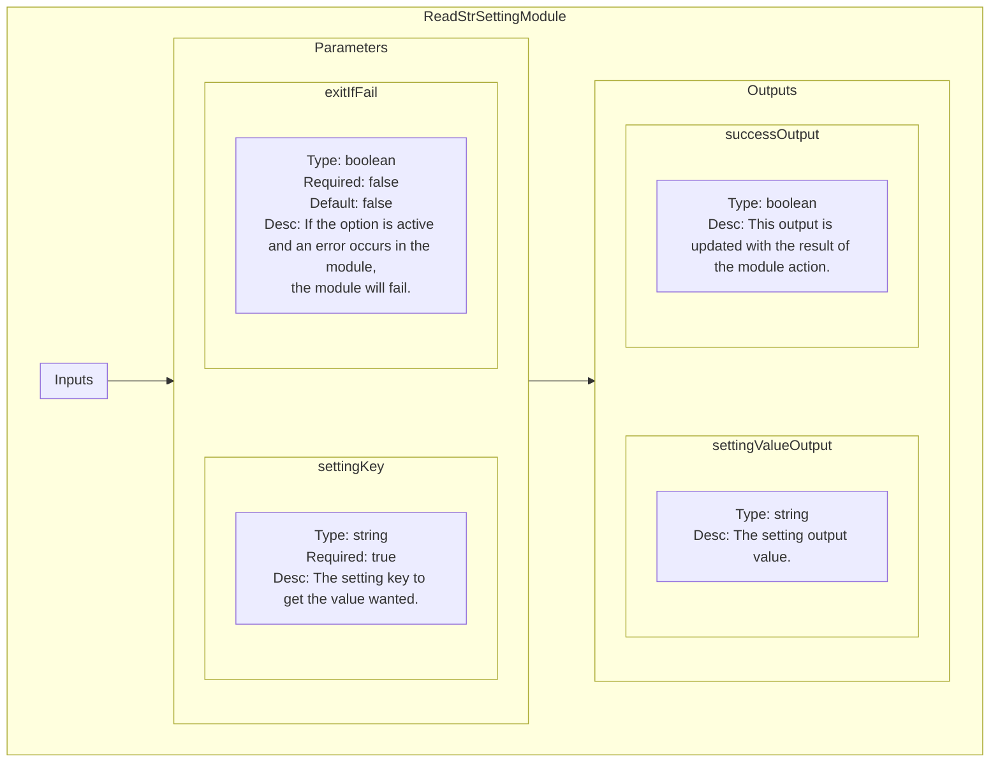

<!--
SPDX-FileCopyrightText: 2024 Benoit Rolandeau <benoit.rolandeau@allcircuits.com>

SPDX-License-Identifier: LicenseRef-ALLCircuits-ACT-1.1
-->

# Read Setting plugin

## Table of contents

- [Read Setting plugin](#read-setting-plugin)
  - [Table of contents](#table-of-contents)
  - [Presentation](#presentation)
  - [Modules list](#modules-list)
    - [ReadStrSettingModule](#readstrsettingmodule)
      - [Presentation](#presentation-1)
      - [Schematic representation](#schematic-representation)

## Presentation

This plugin contains modules used to read the test bed library settings.

## Modules list

### ReadStrSettingModule

#### Presentation

The module reads a string setting from the test bed lib, thanks to the key given.

The key has to be known by the test bed lib or an error is raised.

#### Schematic representation

