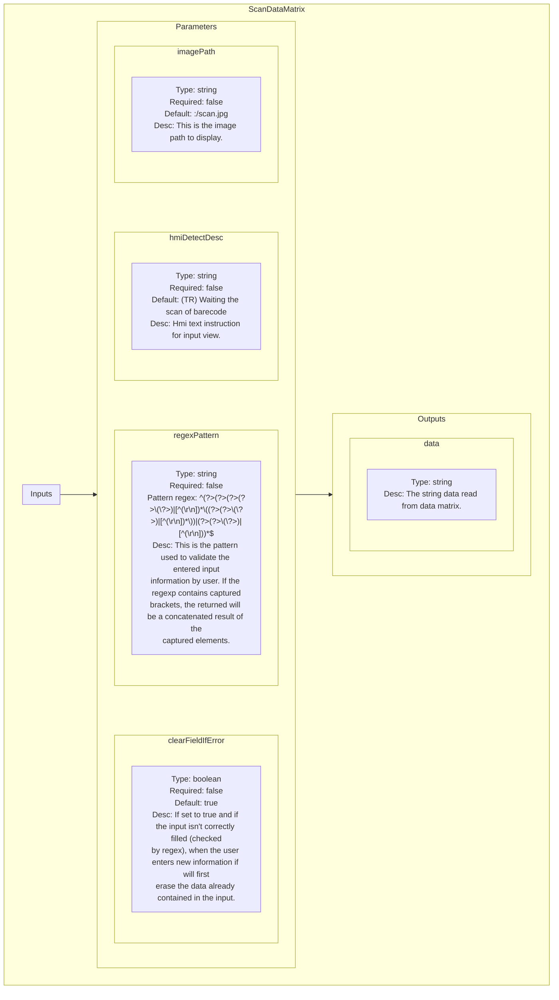

<!--
SPDX-FileCopyrightText: 2024 Benoit Rolandeau <benoit.rolandeau@allcircuits.com>

SPDX-License-Identifier: LicenseRef-ALLCircuits-ACT-1.1
-->

# Scan Data Matrix plugin

## Table of contents

- [Scan Data Matrix plugin](#scan-data-matrix-plugin)
  - [Table of contents](#table-of-contents)
  - [Presentation](#presentation)
  - [Modules list](#modules-list)
    - [ScanDataMatrix](#scandatamatrix)
      - [Presentation](#presentation-1)
      - [Schematic representation](#schematic-representation)

## Presentation

This plugin contains modules to ask user to scan data matrix.

## Modules list

### ScanDataMatrix

#### Presentation

The module asks the user to scan a datamatrix and returns the string returned by the widget.

#### Schematic representation

