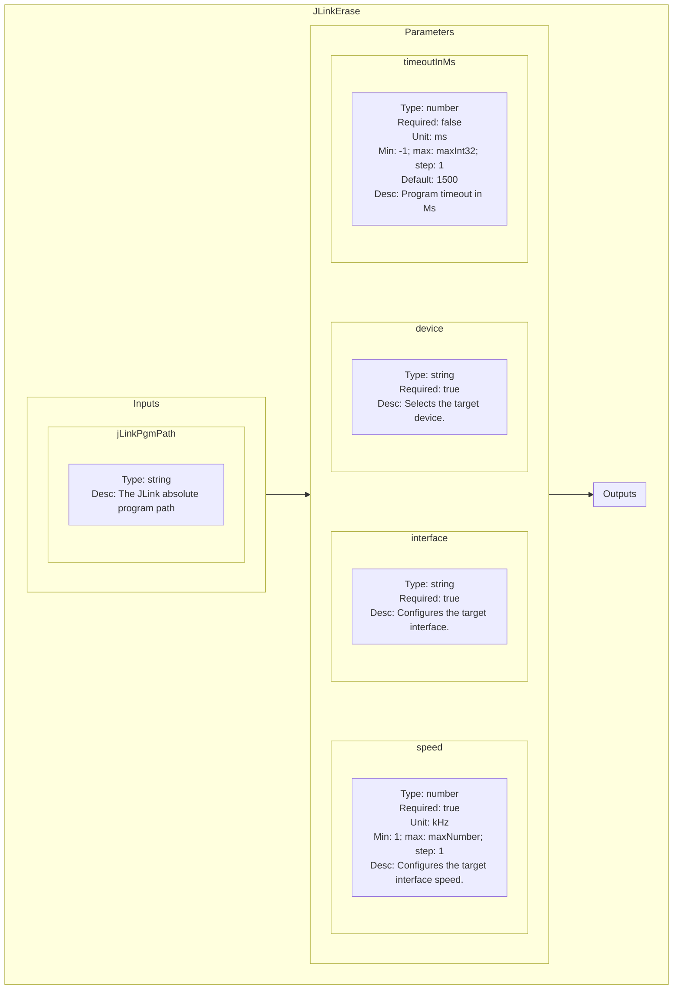
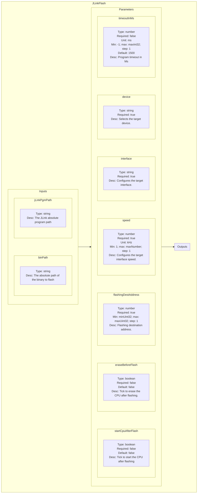
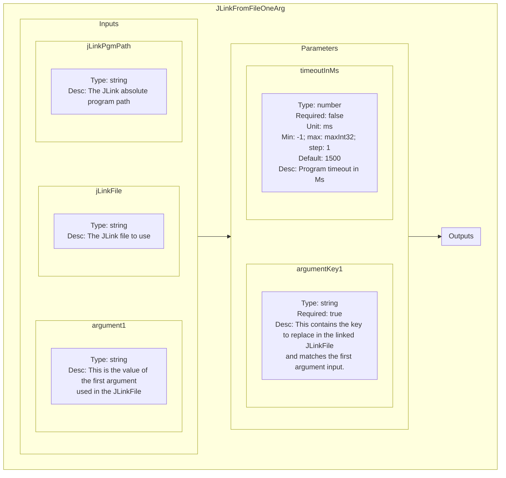

<!--
SPDX-FileCopyrightText: 2024 Benoit Rolandeau <benoit.rolandeau@allcircuits.com>

SPDX-License-Identifier: LicenseRef-ALLCircuits-ACT-1.1
-->

# Segger JLink plugin

## Table of contents

- [Segger JLink plugin](#segger-jlink-plugin)
  - [Table of contents](#table-of-contents)
  - [Presentation](#presentation)
  - [Modules list](#modules-list)
    - [DetectBoard](#detectboard)
      - [Presentation](#presentation-1)
      - [Schematic representation](#schematic-representation)
    - [JLinkErase](#jlinkerase)
      - [Presentation](#presentation-2)
      - [Schematic representation](#schematic-representation-1)
    - [JLinkFlash](#jlinkflash)
      - [Presentation](#presentation-3)
      - [Schematic representation](#schematic-representation-2)
    - [JLinkFromFileOneArg](#jlinkfromfileonearg)
      - [Presentation](#presentation-4)
      - [Schematic representation](#schematic-representation-3)
    - [JLinkReset](#jlinkreset)
      - [Presentation](#presentation-5)
      - [Schematic representation](#schematic-representation-4)

## Presentation

This plugin contains modules to communicate with segger probes; especially JLink probes.

## Modules list

### DetectBoard

#### Presentation

The module tries to detect (or not) a board connecting to a JLink probe.

#### Schematic representation

```mermaid
flowchart LR
    subgraph "DetectBoardAtProgram"
        direction LR
        subgraph "Inputs"
            direction TB
            subgraph Input1[jLinkPgmPath]
                direction TB
                Input1Info["Type: string\nDesc: The JLink absolute program path"]
            end
        end
        subgraph "Parameters"
            direction TB
            subgraph Param1[detectPresence]
                direction TB
                Param1Info["Type: bool\nRequired: true\nDefault: true\nDesc: If true, the module waits to detect a bord.\nIf false, the module waits to be no more connected to a board."]
            end
            subgraph Param2[baseImagePathName]
                direction TB
                Param2Info["Type: string\nRequired: true\nDesc: The path of the image to display with GUI"]
            end
            subgraph Param3[baseImagePathName]
                direction TB
                Param3Info["Type: string\nRequired: true\nDesc: The path of the image to display with GUI"]
            end
            subgraph Param4[hmiDetectDesc]
                direction TB
                Param4Info["Type: string\nRequired: false\nDefault: (TR) Put the board on the test bed.\nDesc: Hmi text instruction if wait board detection"]
            end
            subgraph Param5[hmiNoDetectDesc]
                direction TB
                Param5Info["Type: string\nRequired: false\nDefault: (TR) Take the board out of the test bed.\nDesc: Hmi text instruction if wait no board detection"]
            end
            subgraph Param6[manageBoardOnBenchProblem]
                direction TB
                Param6Info["Type: string\nRequired: false\nDefault: false\nDesc: If enabled, it means that the board may not be detected\nbecause an electronic element is not working on the board."]
            end
            subgraph Param7[boardOnBenchLogError]
                direction TB
                Param7Info["Type: string\nRequired: false\nDefault: A component is not working on the board.\nDesc: This is the detail of error which will be displayed in\nlogs when operator click on the board on bench error button."]
            end
            subgraph Param8[detectTimeoutInMs]
                direction TB
                Param8Info["Type: number\nRequired: false\nUnit: ms\nMin: -1; max: maxInt32; step: 1\nDefault: -1\nDesc: Timeout in Ms; set -1 to disable the timeout"]
            end
            subgraph Param9[waitBetweenTriesInMs]
                direction TB
                Param9Info["Type: number\nRequired: false\nUnit: ms\nMin: -1; max: maxInt32; step: 1\nDefault: 1000\nDesc: This is the time to wait in milliseconds between tries"]
            end
            subgraph Param10[waitForDisplayHmiInMs]
                direction TB
                Param10Info["Type: number\nRequired: false\nUnit: ms\nMin: -1; max: maxInt32; step: 1\nDefault: -1\nDesc: This is the time to wait in milliseconds between displaying the HMI.\nUse this when it's mostly likely to have a compliant test right now."]
            end
            subgraph Param11[timeoutInMs]
                direction TB
                Param11Info["Type: number\nRequired: false\nUnit: ms\nMin: -1; max: maxInt32; step: 1\nDefault: 1500\nDesc: Program timeout in Ms"]
            end
            subgraph Param12[device]
                direction TB
                Param12Info["Type: string\nRequired: true\nDesc: Selects the target device."]
            end
            subgraph Param13[interface]
                direction TB
                Param13Info["Type: string\nRequired: true\nDesc: Configures the target interface."]
            end
            subgraph Param14[speed]
                direction TB
                Param14Info["Type: number\nRequired: true\nUnit: kHz\nMin: 1; max: maxNumber; step: 1\nDesc: Configures the target interface speed."]
            end
            Param1 ~~~ Param2
            Param2 ~~~ Param3
            Param3 ~~~ Param4
            Param4 ~~~ Param5
            Param5 ~~~ Param6
            Param6 ~~~ Param7
            Param7 ~~~ Param8
            Param8 ~~~ Param9
            Param9 ~~~ Param10
            Param10 ~~~ Param11
            Param11 ~~~ Param12
            Param12 ~~~ Param13
            Param13 ~~~ Param14
        end
        subgraph "Outputs"
        end
        Inputs --> Parameters
        Parameters --> Outputs
    end
```

### JLinkErase

#### Presentation

The module erases a board connected to a JLink probe.

#### Schematic representation

### JLinkFlash

#### Presentation

The module flashes a board connected to a JLink probe.

#### Schematic representation

### JLinkFromFileOneArg

#### Presentation

The module replaces one argument and its value in a targetted JLinkFile.

#### Schematic representation

### JLinkReset

#### Presentation

The module resets a board connected to a JLink probe.

#### Schematic representation

